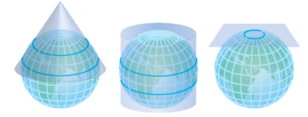

# Introduction to Raster Package
Adam M. Wilson  
March 3, 2015  


----

This script is available:

  * [SpatialAnalysisTutorials repository](http://github.com/adammwilson/SpatialAnalysisTutorials/blob/master/R_RasterIntroduction)
  * Plain text (.R) with commented text 
  [here](https://raw.githubusercontent.com/adammwilson/SpatialAnalysisTutorials/master/R_RasterIntroduction/R_CallingOutsideFunctions.R)

## Language/software integration

With scripting languages it is possible to link together various software and create unified workflows.

### Various options for _primary_ language of a script

* BASH as primary language, call others (R, Python, etc.) as needed
* R as primary, call others (BASH, Python, etc.) as needed
* Python as primary, etc.

Which is best depends on your priorities:  processing speed, interoperability, ease of coding, code content...

## Starting R on Omega

Remember to `source` the .bashrc file at the `$` prompt and then start `R`.
```{}
source .bashrc
R
```

And load the raster package (either from your own privaite library or from mine).

```r
library(raster)  # OR, 
library(raster,lib.loc="/lustre/scratch/client/fas/geodata/aw524/R/")
```

## Load climate data

First set the path to the data directory.  You'll need to uncomment the line setting the directory to `lustre/...`.


```r
datadir="~/Downloads/bio1-9_30s_bil"
#datadir="/lustre/scratch/client/fas/geodata/aw524/data/worldclim"
```

And create an output directory `outputdir` to hold the outputs.  It's a good idea to define these as variables so it's easy to change them later if you move to a different machine.  

```r
outputdir="~/scratch/data/tmp"
## check that the directory exists, and if it doesn't then create it.
if(!file.exists(outputdir)) dir.create(outputdir,recursive=T)
```

This time, let's look at BIO9, which is the [Mean Temperature of Driest Quarter](http://www.worldclim.org/bioclim):

```r
## first define the path to the data:
file=paste0(datadir,"/bio_9.bil") 
## now use that to load the raster dataset:
data=raster(file)
data
```

```
## class       : RasterLayer 
## dimensions  : 18000, 43200, 777600000  (nrow, ncol, ncell)
## resolution  : 0.008333333, 0.008333333  (x, y)
## extent      : -180, 180, -60, 90  (xmin, xmax, ymin, ymax)
## coord. ref. : +proj=longlat +ellps=WGS84 +towgs84=0,0,0,0,0,0,0 +no_defs 
## data source : /Users/adamw/Downloads/bio1-9_30s_bil/bio_9.bil 
## names       : bio_9 
## values      : -521, 366  (min, max)
```


## Calling outside functions from within R
R can do almost anything, but it isn't always the fastest at it...  For example, let's compare cropping a tif file using the `raster` package and `gdal_translate`:

First let's do it using the `crop` function:

```r
r1 = crop(data, extent(-77,-74.5,6,7))
r1
```

```
## class       : RasterLayer 
## dimensions  : 120, 300, 36000  (nrow, ncol, ncell)
## resolution  : 0.008333333, 0.008333333  (x, y)
## extent      : -77, -74.5, 6, 7  (xmin, xmax, ymin, ymax)
## coord. ref. : +proj=longlat +ellps=WGS84 +towgs84=0,0,0,0,0,0,0 +no_defs 
## data source : in memory
## names       : bio_9 
## values      : 58, 281  (min, max)
```


To call functions using the `system` command, you first need to _assemble_ the text string equivalent to what you would run on the command line outside of R.  For example:

```r
paste0("gdal_translate -projwin -77 7 -74.5 6 ",file, " ",outputdir,"/cropped.tif")
```

```
## [1] "gdal_translate -projwin -77 7 -74.5 6 ~/Downloads/bio1-9_30s_bil/bio_9.bil ~/scratch/data/tmp/cropped.tif"
```

We can save that as an object and _wrap_ it in with a `system()` call to actually run it:

```r
cmd=paste0("gdal_translate -projwin -77 7 -74.5 6 ",file, " ",outputdir,"/cropped.tif")
system(cmd)
```

Or even do it all at once.  The depth of nested commands is a matter of personal taste (being consise vs. being clear).  

```r
system(paste0("gdal_translate -projwin -77 7 -74.5 6 ",file, " ",outputdir,"/cropped.tif"))
```


### Processing speed

To compare processing speed, let's use the `system.time` function to record how long the operation takes.  

```r
t1=system.time(
        crop(data,
            extent(-77,-74.5,6,7)))
```

And let's run `gdal_translate` and time it to compare:

```r
t2=system.time(
  system(
    paste0("gdal_translate -projwin -77 7 -74.5 6 ",file, " ",outputdir,"/cropped.tif")
    )
  )
```

The `crop` command took 0.09 seconds, while `gdal_translate` took 0.021.  That's a 76.7X speedup!  And, actually, that's not quite fair to `gdal_translate` because `crop` is keeping the result in RAM (and not writing to disk).  Whether this matters to you depends on the scale of your project.


## Another example: gdalwarp
But there are programs that go beyond the existing functionality of R, so `system()` can be a useful way to keep your entire workflow in R and call other programs as needed.  

For example, it's common to aquire data in different spatial _projections_ that need to be reprojected to a common format prior to analysis.

 [Figure from ESRI](http://webhelp.esri.com/arcgisexplorer/2012/en/map_projections.htm)

A great tool for this is [`gdalwarp`](http://www.gdal.org/gdalwarp.html), which can also mosaic multiple images and perform simple resampling procedures (such as taking the mean of multiple overlapping images).

Let's use it to project the cropped image from WGS84 (latitude-longitude) to an equal area projection that may be more suitable for modeling.  Since the cropped region is from South America, let's use the [South America albers equal area conic](http://spatialreference.org/ref/esri/south-america-albers-equal-area-conic/).  

First, define the projection parameters in [proj4](http://trac.osgeo.org/proj/) format [from here](http://spatialreference.org/ref/esri/south-america-albers-equal-area-conic/):

```r
tsrs="+proj=aea +lat_1=-5 +lat_2=-42 +lat_0=-32 +lon_0=-60 +x_0=0 +y_0=0 +ellps=aust_SA +units=m +no_defs"
```

Then use `paste0` to build the text string:

```r
command=paste0("gdalwarp -r cubic -t_srs '",tsrs,"' ",
               outputdir,"/cropped.tif", " ",outputdir,"/reprojected.tif ")
command
```

```
## [1] "gdalwarp -r cubic -t_srs '+proj=aea +lat_1=-5 +lat_2=-42 +lat_0=-32 +lon_0=-60 +x_0=0 +y_0=0 +ellps=aust_SA +units=m +no_defs' ~/scratch/data/tmp/cropped.tif ~/scratch/data/tmp/reprojected.tif "
```

And run it:

```r
system(command)
```

If you had many files to process, you could also  _wrap_ that system call in a [`foreach` loop](http://trac.osgeo.org/proj/) to use multiple processors simutaneously.  

## Try this:
> Write a `system` command to call `pkfilter` ([from pktools](http://pktools.nongnu.org/html/md_pkfilter.html)) from R to calculate the standard deviation within a 3x3 circular moving window. 

Here's a hint:

```
pkfilter -i input.tif -o filter.tif -dx 3 -dy 3 -f stdev -c
```


## Other example applications of calling external functions from within R:

* MaxEnt species distribution modelling package
* Climate data processing with [CDO](https://code.zmaw.de/projects/cdo) and [NCO](http://nco.sourceforge.net)
* [Circuitscape](http://www.circuitscape.org)
* [GRASS GIS](http://grass.osgeo.org)

R can call virtually any program that can be run from the command line!
