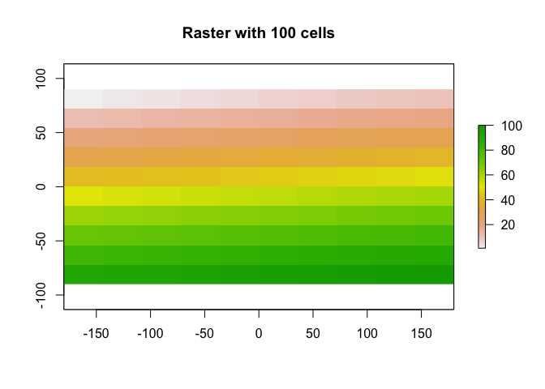

# Introduction to Raster Package
Adam M. Wilson  
February 23, 2015  


----

This script is available:

  * [SpatialAnalysisTutorials repository](http://github.com/adammwilson/SpatialAnalysisTutorials/blob/master/R_RasterIntroduction)
  * Plain text (.R) with commented text 
  [here](https://raw.githubusercontent.com/adammwilson/SpatialAnalysisTutorials/master/R_RasterIntroduction/R_RasterIntroduction.R)
 

## Loading Packages

On the cluster, it's a little more complicated because the system is set up to host many different versions of software simutaneously and thus you need to load the correct `modules` before starting the software.  


```r
module load Apps/R/3.0.2     
module load Rpkgs/RGDAL
module load Rpkgs/GGPLOT2/1.0.0
```

And sometimes the package you want is not currently available.  However, this only works for packages that you already have installed on your system.  To install new packages, you can use `install.packages()` (or use the package manager if you are working in RStudio). 

> R may ask you to choose a CRAN mirror. CRAN is the distributed network of servers that provides access to R's software.  It doesn't really matter which you chose, but closer ones are likely to be faster.  From RStudio, you can select the mirror under Tools→Options or just wait until it asks you.


If you run `install.packages(...)` on Omega, you will probably see something like this:


```r
install.packages("raster")
Installing package into ‘/lustre/home/client/apps/fas/Rpkgs/GGPLOT2/1.0.0/3.0’
(as ‘lib’ is unspecified)
Warning in install.packages("raster") :
  'lib = "/lustre/home/client/apps/fas/Rpkgs/GGPLOT2/1.0.0/3.0"' is not writable
Would you like to use a personal library instead?  (y/n) y
Would you like to create a personal library
~/R/x86_64-unknown-linux-gnu-library/3.0
to install packages into?  (y/n) y
--- Please select a CRAN mirror for use in this session ---
```

Which is fine, you can install a personal copy of a library.  Once the package is installed, you can simply type `library(package)` where `package` is the name of the package you want to load.  


```r
library(raster)
```


Alternatively, you can point to my personal library to avoid this extra step:


```r
library(raster,lib.loc="/lustre/home/client/fas/geodata/aw524/R/x86_64-unknown-linux-gnu-library/3.0")
```

Below we'll run though several of the examples from the excellant [Raster vignette](http://cran.r-project.org/web/packages/raster/vignettes/Raster.pdf) by Robert J. Hijmans.


```r
x <- raster()
x
```

```
## class       : RasterLayer 
## dimensions  : 180, 360, 64800  (nrow, ncol, ncell)
## resolution  : 1, 1  (x, y)
## extent      : -180, 180, -90, 90  (xmin, xmax, ymin, ymax)
## coord. ref. : +proj=longlat +datum=WGS84
```


```r
x <- raster(ncol=36, nrow=18, xmn=-1000, xmx=1000, ymn=-100, ymx=900)
res(x)
```

```
## [1] 55.55556 55.55556
```

```r
res(x) <- 100
res(x)
```

```
## [1] 100 100
```

```r
ncol(x)
```

```
## [1] 20
```


```r
# change the numer of columns (affects resolution)
ncol(x) <- 18
ncol(x)
```

```
## [1] 18
```

```r
res(x)
```

```
## [1] 111.1111 100.0000
```

## Spatial Projections
Raster package uses the standard [coordinate reference system (CRS)](http://www.spatialreference.org).  For example, see the projection format for the [_standard_ WGS84](http://www.spatialreference.org/ref/epsg/4326/).
``{r}
projection(x) <- "+proj=longlat +ellps=WGS84 +datum=WGS84 +no_defs "
x
```


```r
r <- raster(ncol=10, nrow=10)
ncell(r)
```

```
## [1] 100
```

```r
hasValues(r)
```

```
## [1] FALSE
```


Use the 'values' function > # e.g.,

```r
values(r) <- 1:ncell(r)
# or
set.seed(0)
values(r) <- runif(ncell(r))
hasValues(r)
```

```
## [1] TRUE
```

```r
inMemory(r)
```

```
## [1] TRUE
```

```r
values(r)[1:10]
```

```
##  [1] 0.8966972 0.2655087 0.3721239 0.5728534 0.9082078 0.2016819 0.8983897
##  [8] 0.9446753 0.6607978 0.6291140
```

```r
plot(r, main='Raster with 100 cells')
```

 
