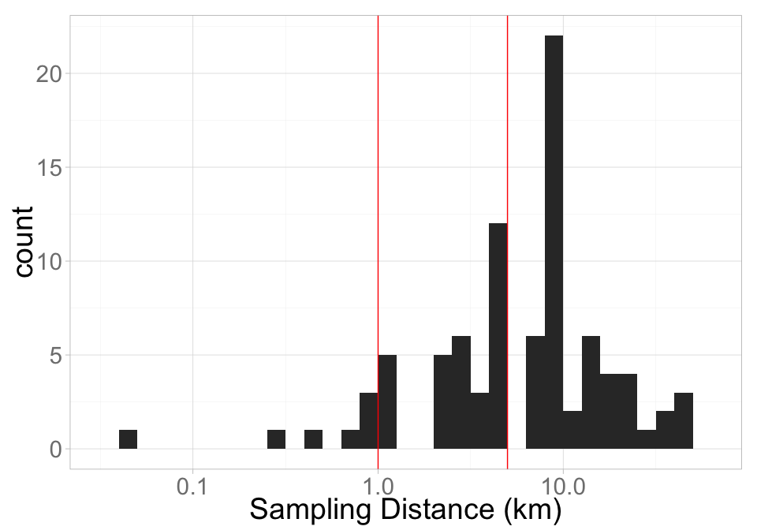
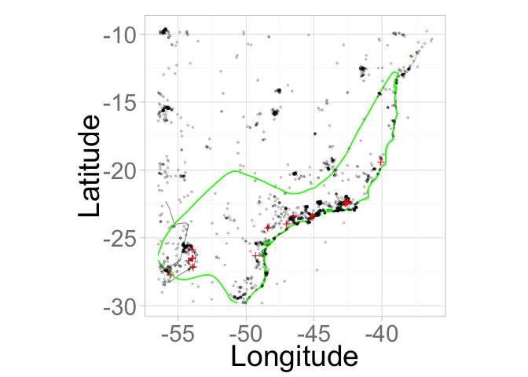
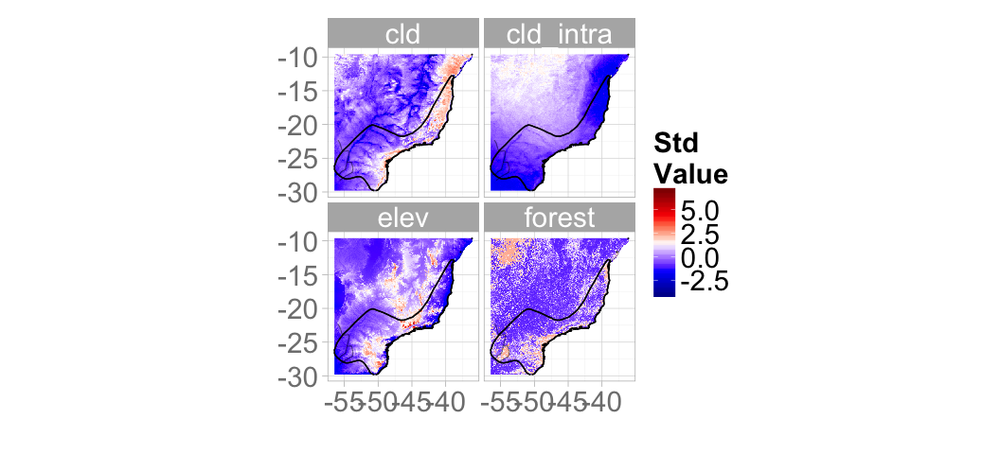
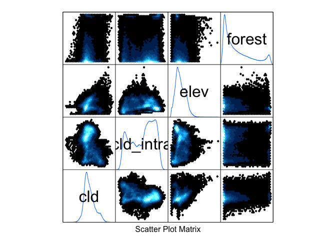
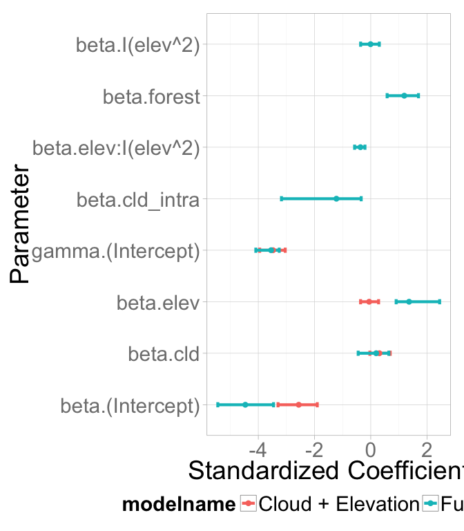
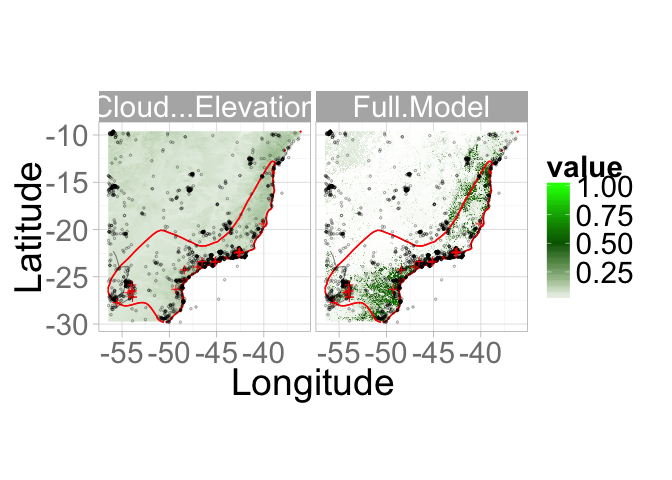

# Overview of hSDM
Adam M. Wilson  
April 7, 2015  


# Example application

## Starting R on Omega (_in an interactive job_)

First `ssh` to omega
```{}
ssh USER@omega.hpc.yale.edu
```

Today we're going to work in an _interactive_ session on a compute node rather than the _head_ node.  To start one, first `source .bashrc` and then request an _interactive_ job with X forwarding.  Then start `R`:

```{}
source .bashrc
qsub -q fas_devel -I -X -l nodes=1:ppn=2
R
```

For more information on what `qsub` means, check out the [Yale HPC FAQ](https://hpc.research.yale.edu/hpc_user_wiki/index.php/Torque_Userguide#qsub_-I).  

You should see something like this:
```{}
[aw524@login-0-0 ~]$ qsub -q fas_devel -I -X -l walltime=02:00:00,nodes=1:ppn=2
qsub: waiting for job 4599636.rocks.omega.hpc.yale.internal to start
qsub: job 4599636.rocks.omega.hpc.yale.internal ready
[aw524@compute-79-4 ~]$ 
```


## Load libraries

And load some packages (either from your own private library or from mine).

```r
lpath="/lustre/scratch/client/fas/geodata/aw524/R/"
#library(package = "lattice",lib.loc=lpath)
library(rgdal)
.libPaths(new=lpath)
packages=c("hSDM","dismo","maptools","sp",
           "maps","coda","rgdal","rgeos",
           "doParallel","rMOL","reshape",
           "ggplot2","knitr","rasterVis")
l=lapply(packages, library,
         character.only=T,quietly=T)

## set some raster and processing options
rasterOptions(chunksize=1000,maxmemory=1000)
ncores=2  # number of processor cores you would like to use
registerDoParallel(ncores)
```

If you don't have the packages above, install them in the package manager or by running `install.packages("doParallel")`. 

## Locate environmental data

First set the path to the data directory.  You can write a script to run on multiple machines by testing the `sysname` (or username, etc.).  


```r
if(Sys.info()[["sysname"]]=="Darwin") datadir="~/work/env/"
if(Sys.info()[["sysname"]]=="Linux") datadir="/lustre/scratch/client/fas/geodata/aw524/data"
```

And create an output directory `outputdir` to hold the outputs.  It's a good idea to define these as variables so it's easy to change them later if you move to a different machine.  

```r
outputdir="~/scratch/data/tmp"
## check that the directory exists, and if it doesn't then create it.
if(!file.exists(outputdir)) dir.create(outputdir,recursive=T)
```

__________

# Example Species: 
## Set species name and extract data from MOL:

```r
#species="Lepidocolaptes_lacrymiger"

species="Tinamus_solitarius"
```

## Query eBird data contained in MOL

_Presences_: all observations of our species
_Trials_: all unique observation locations for any species limited to bounding box of expert range where observer indicated recording all observed species (`all_species_reported='t'`)

> The best method for selecting data to use for _non-detections_ is very case and dataset specific.

Metadata for eBird Reference Dataset ((Version 5.0. Cornell Lab of Ornithology) [is available here](http://ebird.org/ebird/data/download)

## Extract data from MOL

```r
dsp=MOLget(species,type=c("ebird","range"))
```

```
## OGR data source with driver: GeoJSON 
## Source: "http://mol.cartodb.com/api/v2/sql?q=SELECT%20ST_TRANSFORM(the_geom_webmercator,4326)%20as%20the_geom,%20*%20FROM%20get_species_tile('Tinamus%20solitarius')%20WHERE%20type='range'%20AND%20ST_GeometryType(the_geom_webmercator)%20=%20'ST_MultiPolygon'&format=geojson", layer: "OGRGeoJSON"
## with 2 features and 5 fields
## Feature type: wkbMultiPolygon with 2 dimensions
## OGR data source with driver: GeoJSON 
## Source: "http://mol.cartodb.com/api/v2/sql?q=SELECT%20*%20FROM%20ebird_sep2014%20WHERE%20scientific_name='Tinamus%20solitarius'%20AND%20ST_GeometryType(the_geom_webmercator)%20=%20'ST_Point'&format=geojson", layer: "OGRGeoJSON"
## with 150 features and 10 fields
## Feature type: wkbPoint with 2 dimensions
```

```r
points_all=dsp[["ebird"]]
range=dsp[["range"]]
```

Check out the data structure:


```r
kable(head(points_all[,-1]), format = "markdown")
```


|  latitude| longitude|scientific_name    |observation_date         | effort_distance_km|effort_area_ha | cartodb_id|created_at               |updated_at               |
|---------:|---------:|:------------------|:------------------------|------------------:|:--------------|----------:|:------------------------|:------------------------|
| -26.86841| -54.21710|Tinamus solitarius |2006-10-11T02:00:00+0200 |              9.656|NA             |    7922712|2015-02-18T11:19:10+0100 |2015-02-24T20:54:00+0100 |
| -27.15050| -53.89927|Tinamus solitarius |2007-04-13T02:00:00+0200 |              5.000|NA             |    7932609|2015-02-18T11:19:10+0100 |2015-02-24T20:54:00+0100 |
| -19.15049| -40.06817|Tinamus solitarius |2009-07-03T02:00:00+0200 |                 NA|NA             |    7978407|2015-02-18T11:19:10+0100 |2015-02-24T20:54:00+0100 |
| -23.44998| -46.63701|Tinamus solitarius |2009-09-05T02:00:00+0200 |              6.437|NA             |    8012928|2015-02-18T11:19:10+0100 |2015-02-24T20:54:57+0100 |
| -23.35755| -45.12219|Tinamus solitarius |2010-10-25T02:00:00+0200 |                 NA|NA             |    8027277|2015-02-18T11:19:10+0100 |2015-02-24T20:54:57+0100 |
| -23.44998| -46.63701|Tinamus solitarius |2013-04-07T02:00:00+0200 |             11.265|NA             |    8258988|2015-02-18T11:19:10+0100 |2015-02-24T20:56:25+0100 |

Explore  observer effort: sampling duration, distance travelled, and area surveyed.

```r
ggplot(points_all@data,aes(
  x=effort_distance_km))+
  xlab("Sampling Distance (km)")+
  geom_histogram(binwidth = .1)+scale_x_log10()+
  geom_vline(xintercept=c(1,5),col="red")
```

 


Also note that there are many records with missing spatial certainty values.

```r
table("Distance/Area"=!is.na(points_all$effort_distance_km)|
        !is.na(points_all$effort_area_ha))
```

```
## Distance/Area
## FALSE  TRUE 
##    61    89
```

> For this exercise, we'll simply remove points with large or unknown spatial uncertainty.  Incorporating this spatial uncertainty into distribution models is an active area of research.


Filter the data below thresholds specified above using `filter` from the [dplyr library](http://cran.r-project.org/package=dplyr).

```r
cdis=5     # Distance in km
points=points_all[
  (points_all$effort_distance_km<=cdis&
     !is.na(points_all$effort_distance_km)),]
```


## Load eBird sampling dataset


```r
## link to global sampling raster
gsampling=raster(file.path(datadir,"eBirdSampling_filtered.tif"))
names(gsampling)="trials"
## crop to species range to create modelling domain
sampling=crop(gsampling,dsp[["range"]],file.path(outputdir,"sampling.grd"),overwrite=T)   
## assign projection
projection(sampling)="+proj=longlat +datum=WGS84 +no_defs +ellps=WGS84 +towgs84=0,0,0"
```

## Create a combined presence-nondetection point dataset

```r
presences=rasterize(as(points,"SpatialPoints"),sampling,fun='count',background=0)
fitdata=cbind.data.frame(presences=values(presences),trials=values(sampling),coordinates(presences))
## filter to locations with at least one trial
fitdata=fitdata[fitdata$trials>0,]
```


Convert to a spatialDataFrame to faciliate linking with georeferenced environmental data.


```r
coordinates(fitdata)=c("x","y")
projection(fitdata)="+proj=longlat +datum=WGS84 +ellps=WGS84"
fitdata@data[,c("lon","lat")]=coordinates(fitdata)   
```

### Load coastline from maptools package for plotting.

```r
coast <- map_data("world",
                  xlim=c(bbox(range)[1,1]-1,bbox(range)[1,2]+1),
                  ylim=c(bbox(range)[2,1]-1,bbox(range)[2,2]+1))

ggcoast=geom_path(data=coast,
                  aes(x=long,y=lat,group = group),lwd=.1)
```

## Available Species Data

```r
ggplot(fitdata@data,aes(y=lat,x=lon))+
  ggcoast+ 
  geom_path(data=fortify(range),
            aes(y=lat,x=long,group=group),
            col="green")+
  geom_point(data=fitdata@data[fitdata$presences==0,],
             aes(x=lon,y=lat),pch=1,
             col="black",cex=.8,lwd=2,alpha=.3)+
  geom_point(data=fitdata@data[fitdata$presences>=1,],
             aes(x=lon,y=lat),pch=3,
             col="red",cex=2,lwd=3,alpha=1)+
  ylab("Latitude")+xlab("Longitude")+
  coord_equal()+
  xlim(c(min(fitdata$lon),max(fitdata$lon)))+
  ylim(c(min(fitdata$lat),max(fitdata$lat)))
```

```
## Warning: Removed 418 rows containing missing values (geom_path).
```

 

______________________

## Environmental Data

We also have the environmental data available globally.  Like last week, we'll focus on the following variables:


```r
## list of environmental rasters to use (names are used to re-name rasters):
fenv=c(
  cld="cloud/meanannual.tif",
  cld_intra="cloud/intra.tif",
  elev="elevation_mn_GMTED2010_mn.tif",
  forest="tree_mn_percentage_GFC2013.tif")
```

* **forest**:  (1000s %, Hansen, Amatulli&Jetz)
* **elev**: Elevation (m, Amatulli&Jetz)
* **cld**:  Mean Annual Cloud Frequency (1000s %, Wilson&Jetz)
* **cld_intra**: Cloud Seasonality (1000s %, Wilson&Jetz)

> If you want to explore using other variables, you can use `list.files(datadir,recursive=T)` to see all the available files.

To facilitate modelling, let's crop the global rasters to a smaller domain.  We can use the extent of the expert range and the `crop()` function in raster package.


```r
## crop to species domain and copy to project folder 
env=foreach(i=1:length(fenv))%do%{
  fo=file.path(outputdir,paste0(names(fenv)[i],"_clipped.grd"))
  crop(raster(file.path(datadir,fenv[i])),range,file=fo,overwrite=T)   
}
```

Read the environmental data in as a raster stack:

```r
env=stack(list.files(path = outputdir, pattern="*_clipped.grd$" , full.names = TRUE ))
env
## rename layers for convenience
names(env)=names(fenv)
## mask by elevation to set ocean to 0
env=mask(env,env[["elev"]],maskvalue=0)
```

Set the Variable selection is tricky business and we're not going to dwell on it here... We'll use all the following variables.

```r
vars=c("cld","cld_intra","elev","forest")
```

Scaling and centering the environmental variables to zero mean and variance of 1, using the ```scale``` function is typically a good idea.  


```r
senv=scale(env[[vars]])
```


### Visualize the environmental data


```r
## set plotting limits using expert range above

gx=xlim(extent(env)@xmin,extent(env)@xmax)
gy=ylim(extent(env)@ymin,extent(env)@ymax)

## Environmental data
gplot(senv)+
  geom_raster(aes(fill=value)) + 
  facet_wrap(~variable,nrow=2) +
  scale_fill_gradientn(
    colours=c('darkblue','blue','white','red','darkred'),
    na.value="transparent")+
  ylab("")+xlab("")+labs(fill = "Std\nValue")+
    geom_path(data=fortify(range),aes(y=lat,x=long,group=group),fill="green",col="black")+
  ggcoast+gx+gy+coord_equal()
```

 

### Covariate correlation
Scatterplot matrix of the available environmental data.


```r
splom(senv,varname.cex=2)
```

 

### _Annotate_ points with environmental data


```r
fitdata=raster::extract(senv,fitdata,sp=T)

## Due to oppotunistic observations of the species, a few grid cells
## have more observations than trials.  Let's remove them:
table(fitdata$presences>fitdata$trials)
```

```
## 
## FALSE 
##  2133
```

```r
fitdata=fitdata[fitdata$presences<=fitdata$trials,]

## omit rows with missing data (primarily ocean pixels)
fitdata2=na.omit(fitdata@data)

kable(head(fitdata2), format = "markdown")
```


|     | presences| trials|       lon|       lat|       cld| cld_intra|       elev|   forest|
|:----|---------:|------:|---------:|---------:|---------:|---------:|----------:|--------:|
|64   |         0|      4| -55.93750| -9.604161| 0.2292894|  1.210472| -0.9475977| 2.344581|
|65   |         0|     12| -55.92917| -9.604161| 0.2542561|  1.190958| -0.9808400| 2.347961|
|66   |         0|     26| -55.92083| -9.604161| 0.2761020|  1.284349| -0.9069681| 2.379402|
|2513 |         0|      7| -55.93750| -9.612495| 0.0654455|  1.094778| -0.9993080| 2.239779|
|2514 |         0|     36| -55.92917| -9.612495| 0.1450268|  1.137989| -0.9697592| 2.326325|
|4963 |         0|      1| -55.92917| -9.620828| 0.1372247|  1.076658| -0.9993080| 2.287785|

Then transform the full gridded dataset into a `data.frame` with associated environmental data for predicting across space.


```r
pdata=cbind.data.frame(
  coordinates(senv),
  values(senv))
colnames(pdata)[1:2]=c("lon","lat")
## omit rows with missing data (primarily ocean pixels)
pdata=na.omit(pdata)

kable(head(pdata), format = "markdown")
```


|       lon|       lat|      cld| cld_intra|       elev|     forest|
|---------:|---------:|--------:|---------:|----------:|----------:|
| -56.46250| -9.604167| 1.234199| 0.7518776| -0.9586784| -0.7487722|
| -56.45417| -9.604167| 1.184265| 0.7881191| -0.9697592| -0.8549266|
| -56.44583| -9.604167| 1.238880| 0.6877579| -0.9586784|  1.0977736|
| -56.43750| -9.604167| 1.252924| 0.7811496| -0.9549849|  1.6163751|
| -56.42917| -9.604167| 1.098442| 0.8438753| -0.9549849| -0.9232170|
| -56.42083| -9.604167| 1.043828| 0.9846598| -0.9032746| -0.9580384|

This table is similar to the data available from the "Annotate" function in MOL, with the exception that it contains the point data aggregated to the resolution of the environmental data.

## Model Comparison
Let's compare two models, one using interpolated precipitation and the other using satellite-derived cloud data.


```r
# Set number of chains to fit.
mods=data.frame(
  model=c("m1","m2"),
  formula=c("~cld+elev",
            "~cld+cld_intra+elev*I(elev^2)+forest"),
  name=c( "Cloud + Elevation",
          "Full Model"))

kable(mods, format = "markdown")
```


|model |formula                              |name              |
|:-----|:------------------------------------|:-----------------|
|m1    |~cld+elev                            |Cloud + Elevation |
|m2    |~cld+cld_intra+elev*I(elev^2)+forest |Full Model        |

Specify model run-lengths. _Real_ model runs generally require far more iterations (e.g. 10^3-10^5 samples) to achieve convergence and aquire a suitable sample.  For now, we'll do a very short run:


```r
burnin=200
mcmc=100
thin=1
```
## Fit the models

Both site-occupancy or ZIB models (with `hSDM.siteocc()` or `hSDM.ZIB()` functions respectively) can be used to model the presence-absence of a species taking into account imperfect detection. 

The site-occupancy model can be used in all cases but can be less convenient and slower to fit when the repeated visits at each site are made under the same observation conditions. While this is likely not true in this situation (the observations occurred in different years, etc.), we'll use the simpler model today.  For more information about the differences, see the hSDM Vignette Section 4.3.  

### Example: `hSDM.ZIB`
The model integrates two processes, an ecological process associated to the presence or absence of the species due to habitat suitability and an observation process that takes into account the fact that
the probability of detection of the species is less than one.

If the species has been observed at least once during multiple visits, we can assert that the habitat at this site is suitable. And the fact that the species can be unobserved at this site is only due to imperfect detection.

**Ecological process:**


**Observation process:**


In this example we'll assume a spatially constant p(observation|presence), but it's also possible to put in covariates for this parameter.


## Run the model


```r
results=foreach(m=1:nrow(mods),.packages="hSDM") %dopar% { 
  ## if foreach/doParallel are not installed, you can use this line instead
  # for(m in 1:nrow(mods)) { 
  tres=hSDM.ZIB(
    suitability=as.character(mods$formula[m]),  #Formula for suitability
    presences=fitdata2$presences,    # Number of Observed Presences
    observability="~1",             # Formula for p(observation|presence)
    trials=fitdata2$trials,          # Number of Trials
    data=fitdata2,             # Covariates for fitting model
    suitability.pred=pdata,        # Covariates for prediction 
    mugamma=0, Vgamma=1.0E6,      # Priors on Gamma
    gamma.start=0,                # Gamma initial Value
    burnin=burnin, mcmc=mcmc, thin=thin,  # MCMC parameters
    beta.start=0,                 # Initial values for betas
    mubeta=0, Vbeta=1.0E6,        # Priors on Beta
    save.p=0,                     # Don't save full posterior on p
    verbose=1,                    # Report progress
    seed=round(runif(1,0,1e6)))   # Random seed
  tres$model=mods$formula[m]      # Add model formula to result
  tres$modelname=mods$name[m]     # Add model name to result
  return(tres)
  }
```

## Summarize posterior parameters
The model returns full posterior distributions for all model parameters.  To summarize them you need to choose your summary metric (e.g. mean/median/quantiles). 


```r
params=foreach(r1=results,.combine=rbind.data.frame,.packages="coda")%do% {
  data.frame(model=r1$model,
             modelname=r1$modelname,
             parameter=colnames(r1$mcmc),
             mean=summary(r1$mcmc)$statistics[,"Mean"],
             sd=summary(r1$mcmc)$statistics[,"SD"],
             median=summary(r1$mcmc)$quantiles[,"50%"],
             HPDinterval(mcmc(as.matrix(r1$mcmc))),
             RejectionRate=rejectionRate(r1$mcmc))}
```

```r
## plot it
ggplot(params[!grepl("Deviance*",rownames(params)),],
       aes(x=mean,y=parameter,colour=modelname))+
  geom_errorbarh(aes(xmin=lower,xmax=upper,height=.1),lwd=1.5)+
  geom_point(size = 3)+xlab("Standardized Coefficient")+
  ylab("Parameter")+
  theme(legend.position="bottom")
```

 


### Detection probability
The model uses repeat obserations within cells to estimate the probabiliy observation given that the species was present.  


```r
pDetect <-   params[params$parameter=="gamma.(Intercept)",
                    c("modelname","mean")]
pDetect$delta.est <- inv.logit(pDetect$mean)
colnames(pDetect)[2]="gamma.hat"
kable(pDetect,row.names=F, format = "markdown")
```


|modelname         | gamma.hat| delta.est|
|:-----------------|---------:|---------:|
|Cloud + Elevation | -3.477061| 0.0299720|
|Full Model        | -3.546044| 0.0280301|

>  How does this change if you add environmental covariates to the observability regression?

## Predictions for each cell

```r
pred=foreach(r1=results,.combine=stack,.packages="raster")%dopar% {
  tr=rasterFromXYZ(cbind(x=pdata$lon,
                         y=pdata$lat,
                         pred=r1$prob.p.pred))
  names(tr)=r1$modelname    
  return(tr)
  }
```

Compare the model predictions

```r
predscale=scale_fill_gradientn(values=c(0,.5,1),colours=c('white','darkgreen','green'),na.value="transparent")

gplot(pred,maxpixels=1e5)+geom_raster(aes(fill=value)) +
  facet_wrap(~ variable) +
  predscale+
  coord_equal()+
  geom_path(data=fortify(range),
            aes(y=lat,x=long,group=group),
            fill="red",col="red")+
  geom_point(data=fitdata@data[fitdata$presences==0,],
             aes(x=lon,y=lat,fill=1),pch=1,col="black",cex=.8,lwd=2,alpha=.3)+
  geom_point(data=fitdata@data[fitdata$presences>=1,],
             aes(x=lon,y=lat,fill=1),pch=3,col="red",cex=2,lwd=3,alpha=1)+
  ggcoast+gx+gy+ylab("Latitude")+xlab("Longitude")+
  labs(col = "p(presence)")+
  coord_equal()
```

 

## Model selection

Model selection is an extremely important component of any modeling excercise.  See [Hooten and Hobbs (2015)](http://www.esajournals.org/doi/abs/10.1890/14-0661.1) for a recent review of various methods.

## Additional Models in hSDM

`*.icar`
The `*.icar` functions in `hSDM` add _spatial effects_ to the model as well, accounting for spatial autocorrelation of species occurrence.  


`hSDM.binomial` & `hSDM.binomial.iCAR`
Simple and spatial binomial model (perfect detection).

`hSDM.ZIB` & `hSDM.ZIB.iCAR` & `hSDM.ZIB.iCAR.alteration`
Zero-inflated Binomial (example we used today).

`hSDM.ZIP` & `hSDM.ZIP.iCAR` & `hSDM.ZIP.iCAR.alteration`
Zero-inflated Poisson (Abundance data with imperfect detection).

`hSDM.siteocc` & `hSDM.siteocc.iCAR`
Incorporates temporally varying environment to account for changing observation conditions.  

`hSDM.poisson` & `hSDM.poisson.iCAR`
Simple and spatial poisson model for species abundance (perfect detection).

`hSDM.Nmixture` & `hSDM.Nmixture.iCAR`
Poisson model for abundance with imperfect detection.


## Looking forward

* Incorporate multiple scales of observations (e.g. points & polygons)
* Account directly for spatial uncertainties in point observations
* Time-varying covariates with `hSDM.siteocc` or similar
