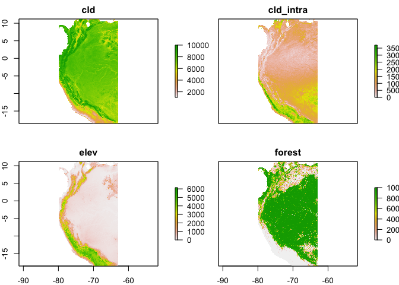
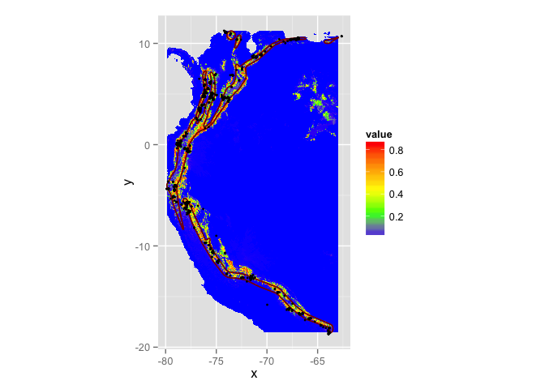

This script is available:

-   [SpatialAnalysisTutorials repository](http://github.com/adammwilson/SpatialAnalysisTutorials/blob/master/SDM_intro)
-   Plain text (.R) with commented text [here](https://raw.githubusercontent.com/adammwilson/SpatialAnalysisTutorials/master/Woodcreeper/SDM.R)

In this session we will perform a simple species distribution model workflow for the Solitary Tinamou (Tinamus solitarius).
 Illustration by Joseph Smit, 1895

Objectives
----------

In this session we will:

1.  Process some raster environmental data
2.  Process occurrence data from various sources
3.  Fit a Bayesian species distribution model using the observations and environmental data
4.  Predict across the landscape and write the results to disk as a geotif (for use in GIS, etc.)

Starting R on Omega
-------------------

Remember to `source` the .bashrc file at the `$` prompt and then start `R`.

    source .bashrc
    R

And load some packages (either from your own privaite library or from mine).

``` {.r}
packages=c("raster","dismo","maptools","sp","maps","dplyr","rgdal","rgeos","doParallel","rMOL","tidyr","rasterVis")

needpackages=packages[!packages%in%rownames(installed.packages())]
lapply(needpackages,install.packages)
lapply(packages, require, character.only=T,quietly=T)
lapply(packages, require, character.only=T,quietly=T, lib.loc="/lustre/scratch/client/fas/geodata/aw524/R/")
```

Load climate data
-----------------

First set the path to the data directory. You'll need to uncomment the line setting the directory to `lustre/...`.

``` {.r}
datadir="~/work/env/"
#datadir="/lustre/scratch/client/fas/geodata/aw524/data/worldclim"
```

And create an output directory `outputdir` to hold the outputs. It's a good idea to define these as variables so it's easy to change them later if you move to a different machine.

``` {.r}
outputdir="~/scratch/data/tmp"
## check that the directory exists, and if it doesn't then create it.
if(!file.exists(outputdir)) dir.create(outputdir,recursive=T)
```

``` {.r}
species="Lepidocolaptes_lacrymiger"

## Extract data from MOL
dsp=MOLget(species,type=c("points","range"))
```

    ## OGR data source with driver: GeoJSON 
    ## Source: "http://mol.cartodb.com/api/v2/sql?q=SELECT%20ST_TRANSFORM(the_geom_webmercator,4326)%20as%20the_geom,%20*%20FROM%20get_detail_map('Lepidocolaptes%20lacrymiger')%20WHERE%20type='points'%20AND%20ST_GeometryType(the_geom_webmercator)%20=%20'ST_Point'&format=geojson", layer: "OGRGeoJSON"
    ## with 3441 features and 7 fields
    ## Feature type: wkbPoint with 2 dimensions
    ## OGR data source with driver: GeoJSON 
    ## Source: "http://mol.cartodb.com/api/v2/sql?q=SELECT%20ST_TRANSFORM(the_geom_webmercator,4326)%20as%20the_geom,%20*%20FROM%20get_species_tile('Lepidocolaptes%20lacrymiger')%20WHERE%20type='range'%20AND%20ST_GeometryType(the_geom_webmercator)%20=%20'ST_MultiPolygon'&format=geojson", layer: "OGRGeoJSON"
    ## with 2 features and 5 fields
    ## Feature type: wkbMultiPolygon with 2 dimensions

Explore dsp object
------------------

``` {.r}
names(dsp)
```

    ## [1] "points" "range"

``` {.r}
range=dsp[["range"]]
range
```

    ## class       : SpatialPolygonsDataFrame 
    ## features    : 2 
    ## extent      : -79.88434, -62.95812, -18.56755, 11.2218  (xmin, xmax, ymin, ymax)
    ## coord. ref. : +proj=longlat +datum=WGS84 +no_defs +ellps=WGS84 +towgs84=0,0,0 
    ## variables   : 5
    ## names       :       cartodb_id,  type, provider, seasonality, presence 
    ## min values  : iucn_birds-10817, range,     iucn,           1,        1 
    ## max values  :   jetz_maps-1533, range,     jetz,           1,        1

``` {.r}
points=dsp[["points"]]
points@data[,c("lon","lat")]=coordinates(points)
points
```

    ## class       : SpatialPointsDataFrame 
    ## features    : 3441 
    ## extent      : -79.9, -62.63066, -18.69, 11.25  (xmin, xmax, ymin, ymax)
    ## coord. ref. : +proj=longlat +datum=WGS84 +no_defs +ellps=WGS84 +towgs84=0,0,0 
    ## variables   : 9
    ## names       :           cartodb_id,   type, provider, seasonality, presence, uncertainty,                     date,       lon,        lat 
    ## min values  : ebird_sep2014-100145, points,    ebird,           0,        1,           0, 1918-10-24T02:00:00+0200, -62.63066,   0.000000 
    ## max values  : gbif_sep2014-6670361, points,     gbif,           0,        1,        9994, 2014-05-30T02:00:00+0200, -79.90000, -18.690000

Load eBird sampling dataset
---------------------------

``` {.r}
## link to global sampling raster
gsampling=raster(file.path(datadir,"eBirdSampling_filtered.tif"))
## crop to species range to create modelling domain
sampling=crop(gsampling,range,
              file=file.path(outputdir,"eBirdSampling_filtered.tif"),overwrite=T)   
## assign projection
projection(sampling)="+proj=longlat +datum=WGS84 +no_defs +ellps=WGS84 +towgs84=0,0,0"

## convert to points within data region
samplingp=as(sampling,"SpatialPointsDataFrame")
samplingp=samplingp[samplingp$eBirdSampling_filtered>0,]

## edit column names to allow aligning with presence observations
colnames(samplingp@data)=c("observation")
samplingp$presence=0
```

Create a combined presence-nondetection point dataset
-----------------------------------------------------

``` {.r}
pdata=rbind(points[,"presence"],samplingp[,"presence"])
pdata@data[,c("lon","lat")]=coordinates(pdata)
table(pdata$presence)
```

    ## 
    ##     0     1 
    ## 13188  3441

Environmental data processing
-----------------------------

``` {.r}
## list of environmental rasters to use (names are used to re-name rasters):
fenv=c(
  cld="cloud/meanannual.tif",
  cld_intra="cloud/intra.tif",
  elev="elevation_mn_GMTED2010_mn.tif",
  forest="tree_mn_percentage_GFC2013.tif")
```

> If you want to explore using other variables, you can use `list.files(datadir,recursive=T)` to see all the available files.

To facilitate modelling, let's crop the global rasters to a smaller domain. We can use the extent of the expert range and the `crop()` function in raster package.

``` {.r}
## crop to species domain and copy to project folder 
foreach(i=1:length(fenv))%do%{
  fo=file.path(outputdir,paste0(names(fenv)[i],"_clipped.tif"))
  crop(raster(file.path(datadir,fenv[i])),range,file=fo,overwrite=T)   
}
```

    ## [[1]]
    ## class       : RasterLayer 
    ## dimensions  : 3575, 2031, 7260825  (nrow, ncol, ncell)
    ## resolution  : 0.008333333, 0.008333333  (x, y)
    ## extent      : -79.88333, -62.95833, -18.56667, 11.225  (xmin, xmax, ymin, ymax)
    ## coord. ref. : +proj=longlat +datum=WGS84 +no_defs +ellps=WGS84 +towgs84=0,0,0 
    ## data source : /Users/adamw/scratch/data/tmp/cld_clipped.tif 
    ## names       : cld_clipped 
    ## values      : 1010, 10000  (min, max)
    ## 
    ## 
    ## [[2]]
    ## class       : RasterLayer 
    ## dimensions  : 3575, 2031, 7260825  (nrow, ncol, ncell)
    ## resolution  : 0.008333333, 0.008333333  (x, y)
    ## extent      : -79.88333, -62.95833, -18.56667, 11.225  (xmin, xmax, ymin, ymax)
    ## coord. ref. : +proj=longlat +datum=WGS84 +no_defs +ellps=WGS84 +towgs84=0,0,0 
    ## data source : /Users/adamw/scratch/data/tmp/cld_intra_clipped.tif 
    ## names       : cld_intra_clipped 
    ## values      : 0, 3790  (min, max)
    ## 
    ## 
    ## [[3]]
    ## class       : RasterLayer 
    ## dimensions  : 3575, 2031, 7260825  (nrow, ncol, ncell)
    ## resolution  : 0.008333333, 0.008333333  (x, y)
    ## extent      : -79.88333, -62.95833, -18.56667, 11.225  (xmin, xmax, ymin, ymax)
    ## coord. ref. : +proj=longlat +datum=WGS84 +no_defs +ellps=WGS84 +towgs84=0,0,0 
    ## data source : /Users/adamw/scratch/data/tmp/elev_clipped.tif 
    ## names       : elev_clipped 
    ## values      : -72, 6460  (min, max)
    ## 
    ## 
    ## [[4]]
    ## class       : RasterLayer 
    ## dimensions  : 3575, 2031, 7260825  (nrow, ncol, ncell)
    ## resolution  : 0.008333333, 0.008333333  (x, y)
    ## extent      : -79.88333, -62.95833, -18.56667, 11.225  (xmin, xmax, ymin, ymax)
    ## coord. ref. : +proj=longlat +datum=WGS84 +no_defs +ellps=WGS84 +towgs84=0,0,0 
    ## data source : /Users/adamw/scratch/data/tmp/forest_clipped.tif 
    ## names       : forest_clipped 
    ## values      : 0, 10000  (min, max)

Read the environmental data in as a raster stack

``` {.r}
env=stack(list.files(path = outputdir, pattern="*_clipped.tif$" , full.names = TRUE ))
## rename layers for convenience
names(env)=sub("_clipped","",names(env))
## mask by elevation to set ocean to 0
env=mask(env,env[["elev"]],maskvalue=0)
## check out the plot
plot(env)
```



Variable selection is tricky business and we're not going to dwell on it here... We'll use the following variables.

``` {.r}
vars=c("cld","cld_intra","elev","forest")
```

Scaling and centering the environmental variables to zero mean and variance of 1, using the `scale` function:

``` {.r}
senv=scale(env[[vars]])
## Plot the rasters
gplot(senv)+geom_tile(aes(fill=value))+facet_wrap(~variable)+
  scale_fill_gradientn(colours=c("blue","green","yellow","red"))+
    coord_equal()
```


Annotate the point records with the scaled environmental data
-------------------------------------------------------------

Add the (scaled) environmental data to each point

``` {.r}
pointsd=raster::extract(senv,pdata,sp=T)
pointsd=na.exclude(pointsd)
```

Explore the data
----------------

Plotting the response (presence/absence data) and the predictors:

``` {.r}
## convert to 'long' format for easier plotting
pointsdl=gather(pointsd@data,variable,value, -lat, -lon, -presence)

ggplot(pointsdl,aes(x=value,y=presence))+facet_wrap(~variable)+
  geom_point()+
  stat_smooth(method = "lm", formula = y ~ x + I(x^2), col="red")+
  geom_smooth(method="gam",formula=y ~ s(x, bs = "cs"))
```


Fit a simple GLM to the data
----------------------------

``` {.r}
kable(head(pointsd))
```

|presence|lon|lat|cld|cld\_intra|elev|forest|
|-------:|--:|--:|--:|---------:|---:|-----:|
|1|-78.77841|-0.051069|1.714173|-1.1243775|0.4390431|-0.1884475|
|1|-77.88925|-0.464082|1.557595|-1.1792226|0.9121285|-1.3271736|
|1|-73.80932|4.262556|1.932123|-1.4106003|0.9138091|0.3638360|
|1|-66.47900|-16.691000|1.297156|-0.3188402|1.2667325|0.5830040|
|1|-79.13255|-4.494885|1.797576|-1.3540413|1.5011744|0.2808065|
|1|-77.88129|-0.589837|1.641785|-1.4123142|1.1112781|0.4575870|

``` {.r}
m1=glm(presence~cld+cld_intra+elev*I(elev^2)+forest,data=pointsd,family=binomial(logit))
summary(m1)
```

    ## 
    ## Call:
    ## glm(formula = presence ~ cld + cld_intra + elev * I(elev^2) + 
    ##     forest, family = binomial(logit), data = pointsd)
    ## 
    ## Deviance Residuals: 
    ##     Min       1Q   Median       3Q      Max  
    ## -1.9623  -0.2377  -0.0219  -0.0009   4.6651  
    ## 
    ## Coefficients:
    ##                Estimate Std. Error z value Pr(>|z|)    
    ## (Intercept)    -5.05391    0.15974 -31.638  < 2e-16 ***
    ## cld             1.24279    0.10073  12.338  < 2e-16 ***
    ## cld_intra       0.12678    0.08594   1.475     0.14    
    ## elev            6.85624    0.38031  18.028  < 2e-16 ***
    ## I(elev^2)      -3.97036    0.31550 -12.584  < 2e-16 ***
    ## forest          1.42572    0.05963  23.910  < 2e-16 ***
    ## elev:I(elev^2)  0.58193    0.08070   7.211 5.54e-13 ***
    ## ---
    ## Signif. codes:  0 '***' 0.001 '**' 0.01 '*' 0.05 '.' 0.1 ' ' 1
    ## 
    ## (Dispersion parameter for binomial family taken to be 1)
    ## 
    ##     Null deviance: 16789  on 16355  degrees of freedom
    ## Residual deviance:  7817  on 16349  degrees of freedom
    ##   (273 observations deleted due to missingness)
    ## AIC: 7831
    ## 
    ## Number of Fisher Scoring iterations: 9

### Prediction

Calculate estimates of p(occurrence) for each cell.
---------------------------------------------------

We can use the `predict` function in the `raster` package to make the predictions across the full raster grid.

``` {.r}
p1=raster::predict(senv,m1,type="response")
gplot(p1,max=1e5)+geom_tile(aes(fill=value))+
  scale_fill_gradientn(colours=c("blue","green","yellow","orange","red"),na.value = "transparent")+
  geom_polygon(aes(x=long,y=lat,group=group),
               data=fortify(range),fill="transparent",col="darkred")+
  geom_point(aes(x = lon, y = lat), data = points@data,col="black",size=1)+
  coord_equal()
```

    ## Regions defined for each Polygons



Save results
------------

Save the results to a geotif for storage and/or use in another GIS.

``` {.r}
writeRaster(p1,file=file.path(outputdir,"prediction.tif"),overwrite=T)
```

    ## class       : RasterLayer 
    ## dimensions  : 3575, 2031, 7260825  (nrow, ncol, ncell)
    ## resolution  : 0.008333333, 0.008333333  (x, y)
    ## extent      : -79.88333, -62.95833, -18.56667, 11.225  (xmin, xmax, ymin, ymax)
    ## coord. ref. : +proj=longlat +datum=WGS84 +no_defs +ellps=WGS84 +towgs84=0,0,0 
    ## data source : /Users/adamw/scratch/data/tmp/prediction.tif 
    ## names       : prediction 
    ## values      : 7.539311e-09, 0.8661494  (min, max)

Summary
=======

In this script we have illustrated a complete workflow, including:

1.  Extracting species data from an online database
2.  Pre-processing large spatial datasets for analysis
3.  Running a (simple) logistic GLM Species Distribution Model to make a prediction of p(occurrence|environment)
4.  Writing results to disk as a geotif (for use in GIS, etc.)
