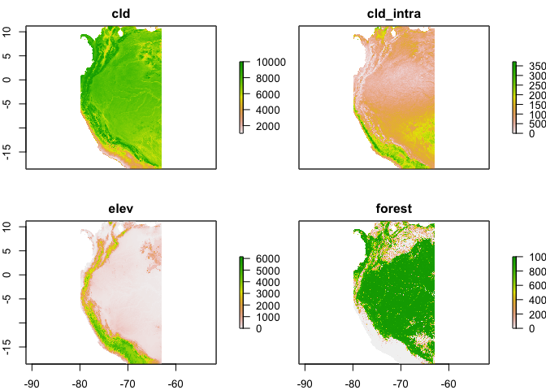
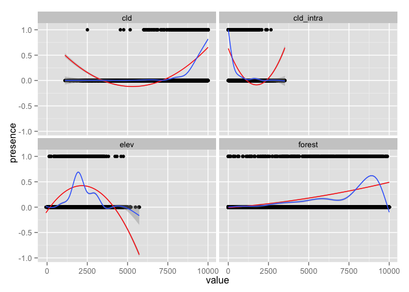
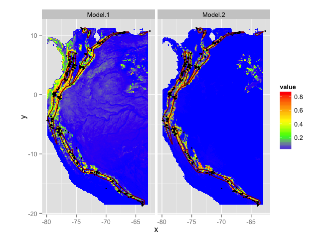

# Simple species distribution model workflow
Adam M. Wilson  
March 24, 2015  


This script is available:

  * [SpatialAnalysisTutorials repository](http://github.com/adammwilson/SpatialAnalysisTutorials/blob/master)
  * Plain text (.R) with commented text 
  [here](https://raw.githubusercontent.com/adammwilson/SpatialAnalysisTutorials/master/SDM_intro/SDM.R)


## Objectives

In this session we will:

 1. Download species data from the Map of Life
 2. Pre-process environmental data
 3. Fit a generalized linear model to estimate the species distribution
 4. Predict across the landscape and write the results to disk (for use in GIS, etc.)


## Starting R on Omega

Remember to `source` the .bashrc file at the `$` prompt and then start `R`.
```{}
source .bashrc
R
```

And load some packages (either from your own privaite library or from mine).

```r
library(rgdal)
packages=c("raster","dismo","maptools","sp","maps","rgeos","doParallel","rMOL","reshape","rasterVis","ggplot2","knitr","texreg")
.libPaths(new="/lustre/scratch/client/fas/geodata/aw524/R/")
needpackages=packages[!packages%in%rownames(installed.packages())]
lapply(needpackages,install.packages)
lapply(packages, require, character.only=T,quietly=T)

rasterOptions(chunksize=1000,maxmemory=1000)
```

## Load climate data

First set the path to the data directory.  You'll need to uncomment the line setting the directory to `lustre/...`.


```r
datadir="~/work/env/"
#datadir="/lustre/scratch/client/fas/geodata/aw524/data"
```

And create an output directory `outputdir` to hold the outputs.  It's a good idea to define these as variables so it's easy to change them later if you move to a different machine.  

```r
outputdir="~/scratch/data/tmp"
## check that the directory exists, and if it doesn't then create it.
if(!file.exists(outputdir)) dir.create(outputdir,recursive=T)
```

## Example Species: *Montane Woodcreeper* (_Lepidocolaptes lacrymiger_)


<br><span style="color:grey; font-size:1em;">Figure from [hbw.com](http://www.hbw.com/species/montane-woodcreeper-lepidocolaptes-lacrymiger) </span>

> This species has a large range, occurring from the coastal cordillera of Venezuela along the Andes south to south-east Peru and central Bolivia. [birdlife.org](http://www.birdlife.org/datazone/speciesfactsheet.php?id=31946)


<br><span style="color:grey; font-size:1em;">Data via [MOL.org](http://map.mol.org/maps/Lepidocolaptes%20lacrymiger) </span>

Set species name:

```r
species="Lepidocolaptes_lacrymiger"

## Extract data from MOL
dsp=MOLget(species,type=c("points","range"))
```


## Explore dsp object


```r
names(dsp)
```

```
## [1] "points" "range"
```

```r
range=dsp[["range"]]
range
```

```
## class       : SpatialPolygonsDataFrame 
## features    : 2 
## extent      : -79.88434, -62.95812, -18.56755, 11.2218  (xmin, xmax, ymin, ymax)
## coord. ref. : +proj=longlat +datum=WGS84 +no_defs +ellps=WGS84 +towgs84=0,0,0 
## variables   : 5
## names       :       cartodb_id,  type, provider, seasonality, presence 
## min values  : iucn_birds-10817, range,     iucn,           1,        1 
## max values  :   jetz_maps-1533, range,     jetz,           1,        1
```

```r
points=dsp[["points"]]
points@data[,c("lon","lat")]=coordinates(points)
points
```

```
## class       : SpatialPointsDataFrame 
## features    : 3441 
## extent      : -79.9, -62.63066, -18.69, 11.25  (xmin, xmax, ymin, ymax)
## coord. ref. : +proj=longlat +datum=WGS84 +no_defs +ellps=WGS84 +towgs84=0,0,0 
## variables   : 9
## names       :           cartodb_id,   type, provider, seasonality, presence, uncertainty,                     date,       lon,        lat 
## min values  : ebird_sep2014-100145, points,    ebird,           0,        1,           0, 1918-10-24T02:00:00+0200, -62.63066,   0.000000 
## max values  : gbif_sep2014-6670361, points,     gbif,           0,        1,        9994, 2014-05-30T02:00:00+0200, -79.90000, -18.690000
```

## Load eBird sampling dataset


```r
## link to global sampling raster
gsampling=raster(file.path(datadir,"eBirdSampling_filtered.tif"))
## crop to species range to create modelling domain
sampling=crop(gsampling,range,file.path(outputdir,"sampling.grd"),overwrite=T)   
## assign projection
projection(sampling)="+proj=longlat +datum=WGS84 +no_defs +ellps=WGS84 +towgs84=0,0,0"

## convert to points within data region
samplingp=as(sampling,"SpatialPointsDataFrame")
samplingp=samplingp[samplingp$eBirdSampling_filtered>0,]

## edit column names to allow aligning with presence observations
colnames(samplingp@data)=c("observation")
samplingp$presence=0
```

## Create a combined presence-nondetection point dataset

```r
pdata=rbind(points[,"presence"],samplingp[,"presence"])
pdata@data[,c("lon","lat")]=coordinates(pdata)
table(pdata$presence)
```

```
## 
##     0     1 
## 13188  3441
```


## Environmental data processing


```r
## list of environmental rasters to use (names are used to re-name rasters):
fenv=c(
  cld="cloud/meanannual.tif",
  cld_intra="cloud/intra.tif",
  elev="elevation_mn_GMTED2010_mn.tif",
  forest="tree_mn_percentage_GFC2013.tif")
```
> If you want to explore using other variables, you can use `list.files(datadir,recursive=T)` to see all the available files.


To facilitate modelling, let's crop the global rasters to a smaller domain.  We can use the extent of the expert range and the `crop()` function in raster package.

```r
## crop to species domain and copy to project folder 
env=foreach(i=1:length(fenv))%do%{
  fo=file.path(outputdir,paste0(names(fenv)[i],"_clipped.grd"))
  crop(raster(file.path(datadir,fenv[i])),range,file=fo,overwrite=T)   
}
```

Read the environmental data in as a raster stack

```r
env=stack(list.files(path = outputdir, pattern="*_clipped.grd$" , full.names = TRUE ))
env
## rename layers for convenience
names(env)=names(fenv)
## mask by elevation to set ocean to 0
env=mask(env,env[["elev"]],maskvalue=0)
## check out the plot
plot(env)
```

 

Variable selection is tricky business and we're not going to dwell on it here... We'll use the following variables.

```r
vars=c("cld","cld_intra","elev","forest")
```

Scaling and centering the environmental variables to zero mean and variance of 1, using the ```scale``` function is typically a good idea.  However, with so many people using this node at the same time, we'll skip this memory intensive step and use the unstandardized variables.  The downside of this is the regression coefficients are more difficult to interpret.  

```r
senv=scale(env[[vars]])
#senv=env[[vars]]
```


## Annotate the point records with the scaled environmental data
Add the (scaled) environmental data to each point

```r
pointsd=raster::extract(senv,pdata,sp=T) 
pointsd=na.exclude(pointsd)
```

Look at the data table:

```r
kable(head(pointsd))
```


 presence         lon          lat    cld   cld_intra   elev   forest
---------  ----------  -----------  -----  ----------  -----  -------
        1   -78.77841    -0.051069   9429         321   1268     6203
        1   -77.88925    -0.464082   9230         289   1831     1636
        1   -73.80932     4.262556   9706         154   1833     8418
        1   -66.47900   -16.691000   8899         791   2253     9297
        1   -79.13255    -4.494885   9535         187   2532     8085
        1   -77.88129    -0.589837   9337         153   2068     8794

## Explore the data
Plotting the response (presence/absence data) and the predictors:

```r
## convert to 'long' format for easier plotting
pointsdl=reshape::melt(pointsd@data,id.vars=c("lat","lon","presence"),variable.name="variable")

ggplot(pointsdl,aes(x=value,y=presence))+facet_wrap(~variable)+
  geom_point()+
  stat_smooth(method = "lm", formula = y ~ x + I(x^2), col="red")+
  geom_smooth(method="gam",formula=y ~ s(x, bs = "cs"))
```

 

# Model Fitting

## Fit a simple GLM to the data
Choosing terms to include in a parametric model can be challenging, especially given the large number of possible interactions, etc.  In this example we'll keep it fairly simple and include only a quadratic term for elevation (as suggested by the above plot).


```r
m1=glm(presence~cld+elev,
       data=pointsd,family=binomial(logit))

m2=glm(presence~cld+cld_intra+elev*I(elev^2)+forest,
       data=pointsd,family=binomial(logit))
```

> Feel free to try various model formulas (adding or removing terms) and see how the model performs.


# Prediction

## Calculate estimates of p(occurrence) for each cell.  
We can use the `predict` function in the `raster` package to make the predictions across the full raster grid and save the output.


```r
p1=raster::predict(senv,m1,type="response",
                   file=file.path(outputdir,"prediction_m1.grd"),overwrite=T)
p2=raster::predict(senv,m2,type="response",
                   file=file.path(outputdir,"prediction_m2.grd"),overwrite=T)
p=stack(p1,p2); names(p)=c("Model 1","Model 2")
```

Plot the results as a map:

```r
gplot(p,max=1e5)+geom_tile(aes(fill=value))+
  facet_wrap(~variable)+
  scale_fill_gradientn(
    colours=c("blue","green","yellow","orange","red"),
    na.value = "transparent")+
  geom_polygon(aes(x=long,y=lat,group=group),
               data=fortify(range),fill="transparent",col="darkred")+
  geom_point(aes(x = lon, y = lat), data = points@data,col="black",size=1)+
  coord_equal()
```

 

## Model Evaluation

In general, it is a good idea to use k-fold data partitioning instead of using the data used for fitting. There is a function in the `dismo` package called `kfold` that makes this convenient. But for now, we'll just evaluate on the same data used for fitting.


Summarize model output.  You can also use `screenreg` to print a more visually pleasing summary.

```r
#screenreg(list(m1,m2),digits = 7,doctype=FALSE,align.center=TRUE)
htmlreg(list(m1,m2),digits = 7,doctype=FALSE,align.center=TRUE)
```


<table cellspacing="0" align="center" style="border: none;">
  <caption align="bottom" style="margin-top:0.3em;">Statistical models</caption>
  <tr>
    <th style="text-align: left; border-top: 2px solid black; border-bottom: 1px solid black; padding-right: 12px;"></th>
    <th style="text-align: left; border-top: 2px solid black; border-bottom: 1px solid black; padding-right: 12px;"><b>Model 1</b></th>
    <th style="text-align: left; border-top: 2px solid black; border-bottom: 1px solid black; padding-right: 12px;"><b>Model 2</b></th>
  </tr>
  <tr>
    <td style="padding-right: 12px; border: none;">(Intercept)</td>
    <td style="padding-right: 12px; border: none;">-19.3409971<sup style="vertical-align: 4px;">***</sup></td>
    <td style="padding-right: 12px; border: none;">-20.8260992<sup style="vertical-align: 4px;">***</sup></td>
  </tr>
  <tr>
    <td style="padding-right: 12px; border: none;"></td>
    <td style="padding-right: 12px; border: none;">(0.3816231)</td>
    <td style="padding-right: 12px; border: none;">(0.8817601)</td>
  </tr>
  <tr>
    <td style="padding-right: 12px; border: none;">cld</td>
    <td style="padding-right: 12px; border: none;">0.0020602<sup style="vertical-align: 4px;">***</sup></td>
    <td style="padding-right: 12px; border: none;">0.0009779<sup style="vertical-align: 4px;">***</sup></td>
  </tr>
  <tr>
    <td style="padding-right: 12px; border: none;"></td>
    <td style="padding-right: 12px; border: none;">(0.0000427)</td>
    <td style="padding-right: 12px; border: none;">(0.0000793)</td>
  </tr>
  <tr>
    <td style="padding-right: 12px; border: none;">elev</td>
    <td style="padding-right: 12px; border: none;">-0.0000277</td>
    <td style="padding-right: 12px; border: none;">0.0105170<sup style="vertical-align: 4px;">***</sup></td>
  </tr>
  <tr>
    <td style="padding-right: 12px; border: none;"></td>
    <td style="padding-right: 12px; border: none;">(0.0000262)</td>
    <td style="padding-right: 12px; border: none;">(0.0007179)</td>
  </tr>
  <tr>
    <td style="padding-right: 12px; border: none;">cld_intra</td>
    <td style="padding-right: 12px; border: none;"></td>
    <td style="padding-right: 12px; border: none;">0.0002173</td>
  </tr>
  <tr>
    <td style="padding-right: 12px; border: none;"></td>
    <td style="padding-right: 12px; border: none;"></td>
    <td style="padding-right: 12px; border: none;">(0.0001473)</td>
  </tr>
  <tr>
    <td style="padding-right: 12px; border: none;">I(elev^2)</td>
    <td style="padding-right: 12px; border: none;"></td>
    <td style="padding-right: 12px; border: none;">-0.0000036<sup style="vertical-align: 4px;">***</sup></td>
  </tr>
  <tr>
    <td style="padding-right: 12px; border: none;"></td>
    <td style="padding-right: 12px; border: none;"></td>
    <td style="padding-right: 12px; border: none;">(0.0000003)</td>
  </tr>
  <tr>
    <td style="padding-right: 12px; border: none;">forest</td>
    <td style="padding-right: 12px; border: none;"></td>
    <td style="padding-right: 12px; border: none;">0.0003555<sup style="vertical-align: 4px;">***</sup></td>
  </tr>
  <tr>
    <td style="padding-right: 12px; border: none;"></td>
    <td style="padding-right: 12px; border: none;"></td>
    <td style="padding-right: 12px; border: none;">(0.0000149)</td>
  </tr>
  <tr>
    <td style="padding-right: 12px; border: none;">elev:I(elev^2)</td>
    <td style="padding-right: 12px; border: none;"></td>
    <td style="padding-right: 12px; border: none;">0.0000000<sup style="vertical-align: 4px;">***</sup></td>
  </tr>
  <tr>
    <td style="padding-right: 12px; border: none;"></td>
    <td style="padding-right: 12px; border: none;"></td>
    <td style="padding-right: 12px; border: none;">(0.0000000)</td>
  </tr>
  <tr>
    <td style="border-top: 1px solid black;">AIC</td>
    <td style="border-top: 1px solid black;">10370.8011995</td>
    <td style="border-top: 1px solid black;">7830.9849023</td>
  </tr>
  <tr>
    <td style="padding-right: 12px; border: none;">BIC</td>
    <td style="padding-right: 12px; border: none;">10393.9082498</td>
    <td style="padding-right: 12px; border: none;">7884.9013529</td>
  </tr>
  <tr>
    <td style="padding-right: 12px; border: none;">Log Likelihood</td>
    <td style="padding-right: 12px; border: none;">-5182.4005998</td>
    <td style="padding-right: 12px; border: none;">-3908.4924512</td>
  </tr>
  <tr>
    <td style="padding-right: 12px; border: none;">Deviance</td>
    <td style="padding-right: 12px; border: none;">10364.8011995</td>
    <td style="padding-right: 12px; border: none;">7816.9849023</td>
  </tr>
  <tr>
    <td style="border-bottom: 2px solid black;">Num. obs.</td>
    <td style="border-bottom: 2px solid black;">16356</td>
    <td style="border-bottom: 2px solid black;">16356</td>
  </tr>
  <tr>
    <td style="padding-right: 12px; border: none;" colspan="3"><span style="font-size:0.8em"><sup style="vertical-align: 4px;">***</sup>p &lt; 0.001, <sup style="vertical-align: 4px;">**</sup>p &lt; 0.01, <sup style="vertical-align: 4px;">*</sup>p &lt; 0.05</span></td>
  </tr>
</table>

## Caveats

1.  In this example we treated eBird _non-detections_ as _absences_ when the probability of detection given presence can be much less than zero. What are the chances that an observer would see a species in a 1km grid cell if it were present there?  
2. We ignored the spatial autocorrelation in species presences and treated each observation as an independent sample.  How can we account for this in SDMs?

Walter will provide some additional readings on the opportunities and challenges of Species Distribution Modeling.  The vignette from the [`dismo` package is also a great resource.](http://cran.r-project.org/web/packages/dismo/vignettes/sdm.pdf)

# Summary

In this script we have illustrated a complete workflow, including:

 1. Extracting species data from an online database
 2. Pre-processing large spatial datasets for analysis
 3. Running a (simple) logistic GLM Species Distribution Model to make a prediction of p(occurrence|environment)
 4. Writing results to disk
 
