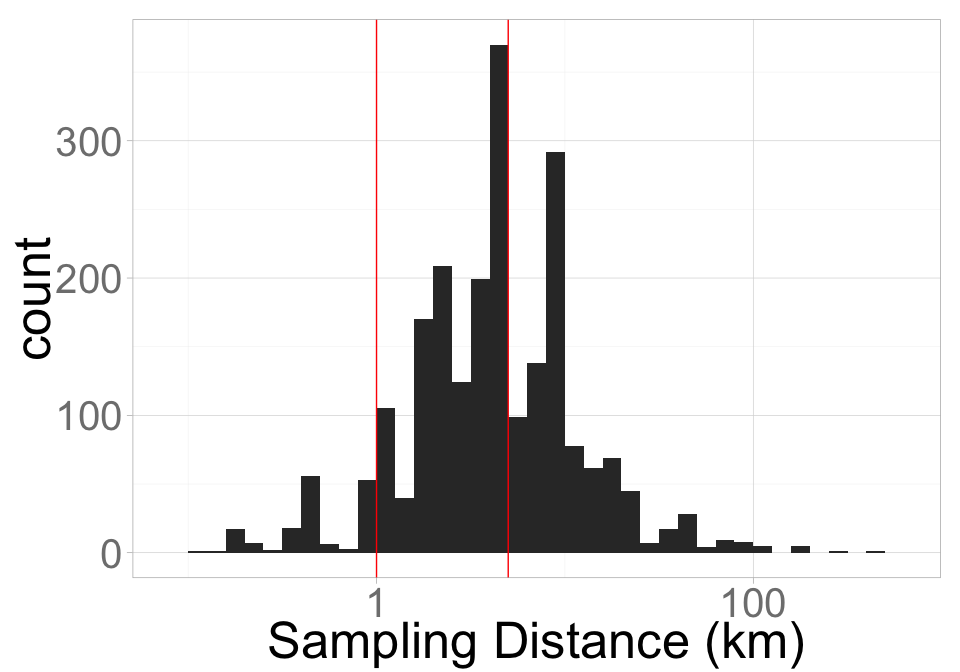
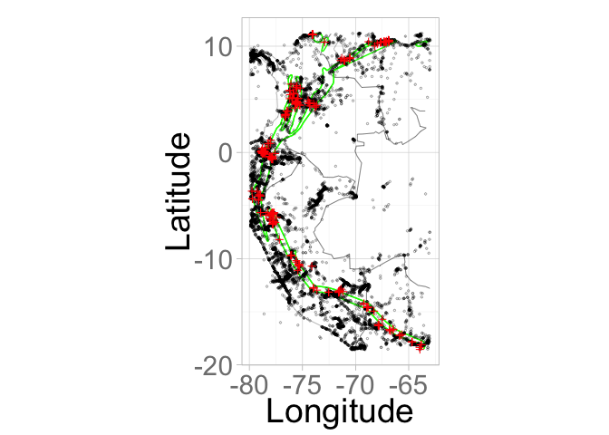
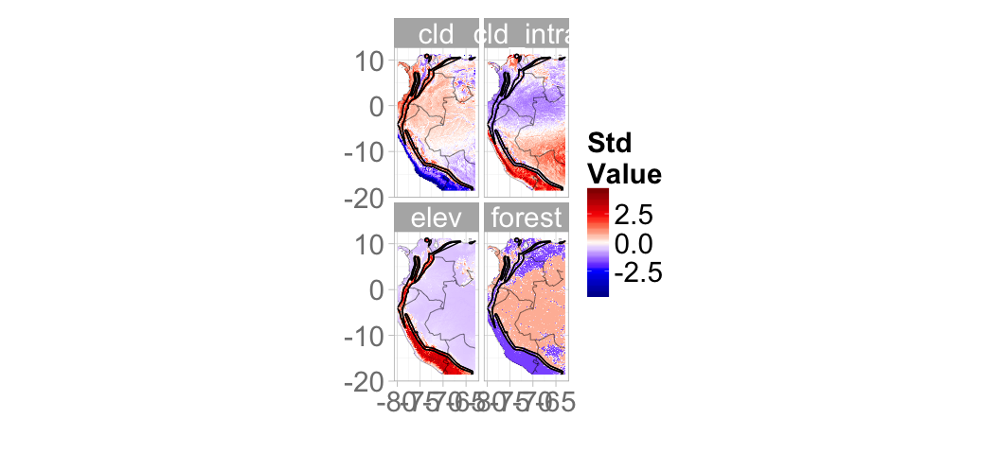
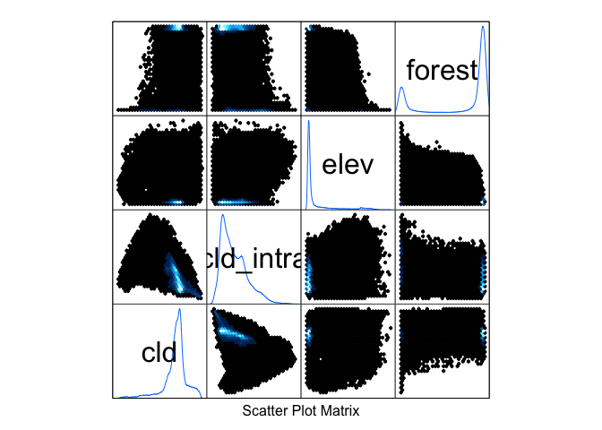
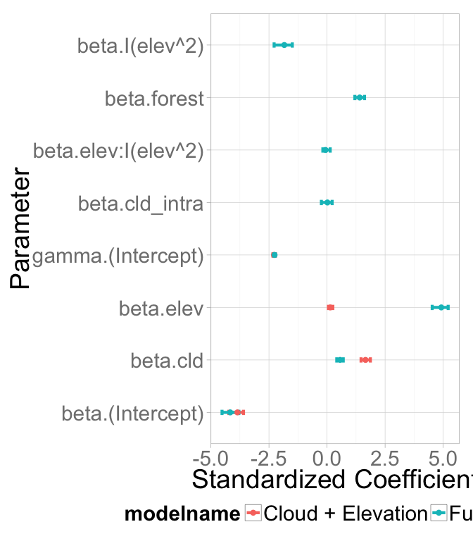
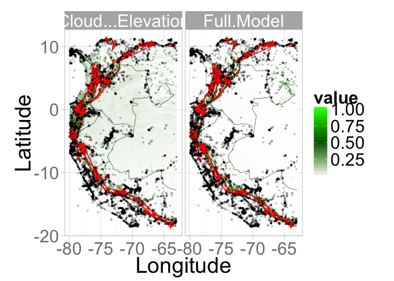

# Overview of hSDM
Adam M. Wilson  
March 31, 2015  


# Introduction to hSDM

## Objectives

* Use opportunistic species occurrence data for occupancy modelling
* Use `hSDM` R package to fit hierarchical distribution model
* Compare output from models built with interpolated and satellite-derived environmental data

> One could easily teach an full semester course on the use of this package and modelling framework.  Today we will provide only a quick introduction.

This script is available:

  * [MD format with images/plots](https://github.com/adammwilson/SpatialAnalysisTutorials/blob/master/SDM_intro2/hSDM_intro.md)
  * [Plain text (.R) with commented text](https://raw.githubusercontent.com/adammwilson/SpatialAnalysisTutorials/master/hSDM_intro.R)

You are welcome to follow along on the screen or download the R script and run it on your computer. 

# Species Distribution Modeling

Two important problems which can bias model results: 

1. imperfect detections ("false absences")
2. spatial correlation of the observations.

## hSDM R Package

Developed by [Ghislain Vieilledent](mailto:ghislain.vieilledent@cirad.fr) with Cory Merow, Jérôme Guélat, Andrew M. Latimer, Marc Kéry, Alan E. Gelfand, Adam M. Wilson, Frédéric Mortier & John A. Silander Jr

* User-friendly statistical functions to overcome limitations above.
* Developed in a hierarchical Bayesian framework. 
* Call a Metropolis-within-Gibbs algorithm (coded in C) to estimate model parameters and drastically the computation time compared to other methods (e.g. ~2-10x faster than OpenBUGS).

### Software for modeling species distribution including imperfect detection.


## The problem of imperfect detection

Site-occupancy models (MacKenzie et al., 2002, _aka_ zero inflated binomial (ZIB) models) for presence-absence data and Nmixture models (Royle, 2004) or zero inflated Poisson (ZIP) models for abundance data (Flores et al., 2009), were developed to solve the problems created by imperfect detection.

_________________

# Example application

## Starting R on Omega (_in an interactive job_)

First `ssh` to omega
```{}
ssh USER@omega.hpc.yale.edu
```

Today we're going to work in an _interactive_ session on a compute node rather than the _head_ node.  To start one, first `source .bashrc` and then request an _interactive_ job with X forwarding.  Then start `R`:

```{}
source .bashrc
qsub -q fas_devel -I -X -l nodes=1:ppn=2
```

For more information on what `qsub` means, check out the [Yale HPC FAQ](https://hpc.research.yale.edu/hpc_user_wiki/index.php/Torque_Userguide#qsub_-I).  

You should see something like this:
```{}
[aw524@login-0-0 ~]$ qsub -q fas_devel -I -X -l walltime=02:00:00,nodes=1:ppn=2
qsub: waiting for job 4599636.rocks.omega.hpc.yale.internal to start
qsub: job 4599636.rocks.omega.hpc.yale.internal ready
[aw524@compute-79-4 ~]$ 
```


## Load libraries

And load some packages (either from your own privaite library or from mine).

```r
lpath="/lustre/scratch/client/fas/geodata/aw524/R/"
library(package = "lattice",lib.loc=lpath)
library(rgdal)
.libPaths(new=lpath)
packages=c("hSDM","dismo","maptools","sp","maps","coda",
           "rgdal","rgeos","doParallel","rMOL","reshape","ggplot2","knitr")
l=lapply(packages, library, lib.loc=lpath, character.only=T,quietly=T)

rasterOptions(chunksize=1000,maxmemory=1000)
ncores=2  # number of processor cores you would like to use
registerDoParallel(ncores)
```

If you don't have the packages above, install them in the package manager or by running `install.packages("doParallel")`. 

## Locate environmental data

First set the path to the data directory.  You can write a script to run on multiple machines by testing the `sysname` (or username, etc.).  


```r
if(Sys.info()[["sysname"]]=="Darwin") datadir="~/work/env/"
if(Sys.info()[["sysname"]]=="Linux") datadir="/lustre/scratch/client/fas/geodata/aw524/data"
```

And create an output directory `outputdir` to hold the outputs.  It's a good idea to define these as variables so it's easy to change them later if you move to a different machine.  

```r
outputdir="~/scratch/data/tmp"
## check that the directory exists, and if it doesn't then create it.
if(!file.exists(outputdir)) dir.create(outputdir,recursive=T)
```

__________

# Example Species: *Montane Woodcreeper* (_Lepidocolaptes lacrymiger_)


<br><span style="color:grey; font-size:1em;">Figure from [hbw.com](http://www.hbw.com/species/montane-woodcreeper-lepidocolaptes-lacrymiger) </span>

> This species has a large range, occurring from the coastal cordillera of Venezuela along the Andes south to south-east Peru and central Bolivia. [birdlife.org](http://www.birdlife.org/datazone/speciesfactsheet.php?id=31946)


<br><span style="color:grey; font-size:1em;">Data via [MOL.org](http://map.mol.org/maps/Lepidocolaptes%20lacrymiger) </span>

## Set species name and extract data from MOL:

```r
species="Lepidocolaptes_lacrymiger"
```


## Query eBird data contained in MOL

* Find all observations of our species
* Find all unique observation locations for any species limited to bounding box of expert range
* Filter to where observer indicated recording all observed species (`all_species_reported='t'`)

> The best method for selecting data to use for _non-detections_ is very case and dataset specific.

Metadata for eBird^[M. Arthur Munson, Kevin Webb, Daniel Sheldon, Daniel Fink, Wesley M. Hochachka, Marshall Iliff, Mirek Riedewald, Daria Sorokina, Brian Sullivan, Christopher Wood, and Steve Kelling. The eBird Reference Dataset, Version 5.0. Cornell Lab of Ornithology and National Audubon Society, Ithaca, NY, January 2013.] is [available here](http://ebird.org/ebird/data/download)

## Extract data from MOL

```r
dsp=MOLget(species,type=c("ebird","range"))
```

```
## OGR data source with driver: GeoJSON 
## Source: "http://mol.cartodb.com/api/v2/sql?q=SELECT%20ST_TRANSFORM(the_geom_webmercator,4326)%20as%20the_geom,%20*%20FROM%20get_species_tile('Lepidocolaptes%20lacrymiger')%20WHERE%20type='range'%20AND%20ST_GeometryType(the_geom_webmercator)%20=%20'ST_MultiPolygon'&format=geojson", layer: "OGRGeoJSON"
## with 2 features and 5 fields
## Feature type: wkbMultiPolygon with 2 dimensions
## OGR data source with driver: GeoJSON 
## Source: "http://mol.cartodb.com/api/v2/sql?q=SELECT%20*%20FROM%20ebird_sep2014%20WHERE%20scientific_name='Lepidocolaptes%20lacrymiger'%20AND%20ST_GeometryType(the_geom_webmercator)%20=%20'ST_Point'&format=geojson", layer: "OGRGeoJSON"
## with 3352 features and 10 fields
## Feature type: wkbPoint with 2 dimensions
```

```r
points_all=dsp[["ebird"]]
range=dsp[["range"]]
```

Check out the data structure:


```r
kable(head(points_all[,-1]), format = "markdown")
```


|   latitude| longitude|scientific_name           |observation_date         | effort_distance_km|effort_area_ha | cartodb_id|created_at               |updated_at               |
|----------:|---------:|:-------------------------|:------------------------|------------------:|:--------------|----------:|:------------------------|:------------------------|
|  -0.051069| -78.77841|Lepidocolaptes lacrymiger |1996-02-13T01:00:00+0100 |              9.656|NA             |       5083|2015-02-18T11:19:10+0100 |2015-02-24T17:54:27+0100 |
|  -0.464081| -77.88925|Lepidocolaptes lacrymiger |1996-04-06T02:00:00+0200 |              3.219|NA             |       8655|2015-02-18T11:19:10+0100 |2015-02-24T17:54:27+0100 |
|   4.262556| -73.80932|Lepidocolaptes lacrymiger |1989-10-16T01:00:00+0100 |                 NA|NA             |       9137|2015-02-18T11:19:10+0100 |2015-02-24T17:54:27+0100 |
| -16.691000| -66.47900|Lepidocolaptes lacrymiger |2001-08-18T02:00:00+0200 |              1.000|NA             |      12207|2015-02-18T11:19:10+0100 |2015-02-24T17:54:27+0100 |
|  -4.494885| -79.13255|Lepidocolaptes lacrymiger |1999-09-08T02:00:00+0200 |             20.000|NA             |      14528|2015-02-18T11:19:10+0100 |2015-02-24T17:54:27+0100 |
|  -0.589837| -77.88129|Lepidocolaptes lacrymiger |2000-07-29T02:00:00+0200 |              1.609|NA             |      15384|2015-02-18T11:19:10+0100 |2015-02-24T17:54:27+0100 |

Explore  observer effort: sampling duration, distance travelled, and area surveyed.

```r
ggplot(points_all@data,aes(
  x=effort_distance_km))+
  xlab("Sampling Distance (km)")+
  geom_histogram(binwidth = .1)+scale_x_log10()+
  geom_vline(xintercept=c(1,5),col="red")
```

 


Also note that there are many records with missing spatial certainty values.

```r
table("Distance/Area"=!is.na(points_all$effort_distance_km)|
        !is.na(points_all$effort_area_ha))
```

```
## Distance/Area
## FALSE  TRUE 
##  1034  2318
```

> For this exercise, we'll simply remove points with large or unknown spatial uncertainty.  Incorporating this spatial uncertainty into distribution models is an active area of research.


Filter the data below thresholds specified above using `filter` from the [dplyr library](http://cran.r-project.org/package=dplyr).

```r
cdis=5     # Distance in km
points=points_all[
  (points_all$effort_distance_km<=cdis&
     !is.na(points_all$effort_distance_km)),]
```


## Load eBird sampling dataset


```r
## link to global sampling raster
gsampling=raster(file.path(datadir,"eBirdSampling_filtered.tif"))
names(gsampling)="trials"
## crop to species range to create modelling domain
sampling=crop(gsampling,dsp[["range"]],file.path(outputdir,"sampling.grd"),overwrite=T)   
## assign projection
projection(sampling)="+proj=longlat +datum=WGS84 +no_defs +ellps=WGS84 +towgs84=0,0,0"
```

## Create a combined presence-nondetection point dataset

```r
presences=rasterize(as(points,"SpatialPoints"),sampling,fun='count',background=0)
fitdata=cbind.data.frame(presences=values(presences),trials=values(sampling),coordinates(presences))
## filter to locations with at least one trial
fitdata=fitdata[fitdata$trials>0,]
```


Convert to a spatialDataFrame to faciliate linking with georeferenced environmental data.


```r
coordinates(fitdata)=c("x","y")
projection(fitdata)="+proj=longlat +datum=WGS84 +ellps=WGS84"
fitdata@data[,c("lon","lat")]=coordinates(fitdata)   
```

### Load coastline from maptools package for plotting.

```r
coast <- map_data("world",
                  xlim=c(bbox(range)[1,1]-1,bbox(range)[1,2]+1),
                  ylim=c(bbox(range)[2,1]-1,bbox(range)[2,2]+1))

ggcoast=geom_path(data=coast,
                  aes(x=long,y=lat,group = group),lwd=.1)
```

## Available Species Data

```r
ggplot(fitdata@data,aes(y=lat,x=lon))+
  ggcoast+ 
  geom_path(data=fortify(range),
            aes(y=lat,x=long,group=piece),
            col="green")+
  geom_point(data=fitdata@data[fitdata$presences==0,],
             aes(x=lon,y=lat),pch=1,
             col="black",cex=.8,lwd=2,alpha=.3)+
  geom_point(data=fitdata@data[fitdata$presences>=1,],
             aes(x=lon,y=lat),pch=3,
             col="red",cex=2,lwd=3,alpha=1)+
  ylab("Latitude")+xlab("Longitude")+
  coord_equal()+
  xlim(c(min(fitdata$lon),max(fitdata$lon)))+
  ylim(c(min(fitdata$lat),max(fitdata$lat)))
```

```
## Warning: Removed 30 rows containing missing values (geom_path).
```

 

______________________

## Environmental Data

We also have the environmental data available globally.  Like last week, we'll focus on the following variables:


```r
## list of environmental rasters to use (names are used to re-name rasters):
fenv=c(
  cld="cloud/meanannual.tif",
  cld_intra="cloud/intra.tif",
  elev="elevation_mn_GMTED2010_mn.tif",
  forest="tree_mn_percentage_GFC2013.tif")
```

* **forest**:  (1000s %, Hansen, Amatulli&Jetz)
* **elev**: Elevation (m, Amatulli&Jetz)
* **cld**:  Mean Annual Cloud Frequency (1000s %, Wilson&Jetz)
* **cld_intra**: Cloud Seasonality (1000s %, Wilson&Jetz)

> If you want to explore using other variables, you can use `list.files(datadir,recursive=T)` to see all the available files.

To facilitate modelling, let's crop the global rasters to a smaller domain.  We can use the extent of the expert range and the `crop()` function in raster package.


```r
## crop to species domain and copy to project folder 
env=foreach(i=1:length(fenv))%do%{
  fo=file.path(outputdir,paste0(names(fenv)[i],"_clipped.grd"))
  crop(raster(file.path(datadir,fenv[i])),range,file=fo,overwrite=T)   
}
```

Read the environmental data in as a raster stack:

```r
env=stack(list.files(path = outputdir, pattern="*_clipped.grd$" , full.names = TRUE ))
env
## rename layers for convenience
names(env)=names(fenv)
## mask by elevation to set ocean to 0
env=mask(env,env[["elev"]],maskvalue=0)
```

Set the Variable selection is tricky business and we're not going to dwell on it here... We'll use all the following variables.

```r
vars=c("cld","cld_intra","elev","forest")
```

Scaling and centering the environmental variables to zero mean and variance of 1, using the ```scale``` function is typically a good idea.  


```r
senv=scale(env[[vars]])
```


### Visualize the environmental data


```r
## set plotting limits using expert range above

gx=xlim(extent(env)@xmin,extent(env)@xmax)
gy=ylim(extent(env)@ymin,extent(env)@ymax)

## Environmental data
gplot(senv)+
  geom_raster(aes(fill=value)) + 
  facet_wrap(~variable,nrow=2) +
  scale_fill_gradientn(
    colours=c('darkblue','blue','white','red','darkred'),
    na.value="transparent")+
  ylab("")+xlab("")+labs(fill = "Std\nValue")+
    geom_path(data=fortify(range),aes(y=lat,x=long,group=piece),fill="green",col="black")+
  ggcoast+gx+gy+coord_equal()
```

 

### Covariate correlation
Scatterplot matrix of the available environmental data.


```r
splom(senv,varname.cex=2)
```

 

### _Annotate_ points with environmental data


```r
fitdata=raster::extract(senv,fitdata,sp=T)

## Due to oppotunistic observations of the species, a few grid cells
## have more observations than trials.  Let's remove them:
table(fitdata$presences>fitdata$trials)
```

```
## 
## FALSE  TRUE 
## 13186     2
```

```r
fitdata=fitdata[fitdata$presences<=fitdata$trials,]

## omit rows with missing data (primarily ocean pixels)
fitdata2=na.omit(fitdata@data)

kable(head(fitdata2), format = "markdown")
```


|     | presences| trials|       lon|      lat|        cld|  cld_intra|       elev|     forest|
|:----|---------:|------:|---------:|--------:|----------:|----------:|----------:|----------:|
|687  |         0|      2| -74.16250| 11.22084| -0.9688942|  3.2478049| -0.5987197| -1.6044373|
|783  |         0|      1| -73.36250| 11.22084| -0.4291335|  0.5175475| -0.6180465| -0.9444399|
|785  |         0|      1| -73.34583| 11.22084| -0.4126102|  0.4798415| -0.6146853| -1.1142390|
|786  |         0|      1| -73.33750| 11.22084| -0.4212653|  0.4489911| -0.6130047| -1.4206753|
|1241 |         0|      2| -69.54583| 11.22084|  1.1468732| -0.8861441|  0.2634217|  0.4553430|
|2710 |         0|      4| -74.22917| 11.21250| -1.5346200|  2.4456954| -0.5600662| -1.5156730|

Then transform the full gridded dataset into a `data.frame` with associated environmental data for predicting across space.


```r
pdata=cbind.data.frame(
  coordinates(senv),
  values(senv))
colnames(pdata)[1:2]=c("lon","lat")
## omit rows with missing data (primarily ocean pixels)
pdata=na.omit(pdata)

kable(head(pdata), format = "markdown")
```


|    |       lon|      lat|       cld| cld_intra|       elev|    forest|
|:---|---------:|--------:|---------:|---------:|----------:|---------:|
|678 | -74.23750| 11.22083| -1.838334|  2.216032| -0.6037615| -1.655552|
|679 | -74.22917| 11.22083| -1.684116|  2.341147| -0.5558647| -1.028218|
|680 | -74.22083| 11.22083| -1.492131|  2.531391| -0.5096486| -1.144409|
|681 | -74.21250| 11.22083| -1.225399|  2.869031| -0.5987197| -1.717886|
|682 | -74.20417| 11.22083| -1.113670|  3.060989| -0.6062824| -1.700682|
|683 | -74.19583| 11.22083| -1.054658|  3.150112| -0.6121644| -1.729356|

This table is similar to the data available from the "Annotate" function in MOL, with the exception that it contains the point data aggregated to the resolution of the environmental data.

## Model Comparison
Let's compare two models, one using interpolated precipitation and the other using satellite-derived cloud data.


```r
# Set number of chains to fit.
mods=data.frame(
  model=c("m1","m2"),
  formula=c("~cld+elev",
            "~cld+cld_intra+elev*I(elev^2)+forest"),
  name=c( "Cloud + Elevation",
          "Full Model"))

kable(mods, format = "markdown")
```


|model |formula                              |name              |
|:-----|:------------------------------------|:-----------------|
|m1    |~cld+elev                            |Cloud + Elevation |
|m2    |~cld+cld_intra+elev*I(elev^2)+forest |Full Model        |

Specify model run-lengths. _Real_ model runs generally require far more iterations (e.g. 10^3-10^5 samples) to achieve convergence and aquire a suitable sample.  For now, we'll do a very short run:


```r
burnin=200
mcmc=100
thin=1
```
## Fit the models

Both site-occupancy or ZIB models (with `hSDM.siteocc()` or `hSDM.ZIB()` functions respectively) can be used to model the presence-absence of a species taking into account imperfect detection. 

The site-occupancy model can be used in all cases but can be less convenient and slower to fit when the repeated visits at each site are made under the same observation conditions. While this is likely not true in this situation (the observations occurred in different years, etc.), we'll use the simpler model today.  For more information about the differences, see the hSDM Vignette Section 4.3.  

### Example: `hSDM.ZIB`
The model integrates two processes, an ecological process associated to the presence or absence of the species due to habitat suitability and an observation process that takes into account the fact that
the probability of detection of the species is less than one.

If the species has been observed at least once during multiple visits, we can assert that the habitat at this site is suitable. And the fact that the species can be unobserved at this site is only due to imperfect detection.

**Ecological process:**


**Observation process:**


In this example we'll assume a spatially constant p(observation|presence), but it's also possible to put in covariates for this parameter.


## Run the model


```r
results=foreach(m=1:nrow(mods),.packages="hSDM") %dopar% { 
  ## if foreach/doParallel are not installed, you can use this line instead
  # for(m in 1:nrow(mods)) { 
  tres=hSDM.ZIB(
    suitability=as.character(mods$formula[m]),  #Formula for suitability
    presences=fitdata2$presences,    # Number of Observed Presences
    observability="~1",             # Formula for p(observation|presence)
    trials=fitdata2$trials,          # Number of Trials
    data=fitdata2,             # Covariates for fitting model
    suitability.pred=pdata,        # Covariates for prediction 
    mugamma=0, Vgamma=1.0E6,      # Priors on Gamma
    gamma.start=0,                # Gamma initial Value
    burnin=burnin, mcmc=mcmc, thin=thin,  # MCMC parameters
    beta.start=0,                 # Initial values for betas
    mubeta=0, Vbeta=1.0E6,        # Priors on Beta
    save.p=0,                     # Don't save full posterior on p
    verbose=1,                    # Report progress
    seed=round(runif(1,0,1e6)))   # Random seed
  tres$model=mods$formula[m]      # Add model formula to result
  tres$modelname=mods$name[m]     # Add model name to result
  return(tres)
  }
```

## Summarize posterior parameters
The model returns full posterior distributions for all model parameters.  To summarize them you need to choose your summary metric (e.g. mean/median/quantiles). 


```r
params=foreach(r1=results,.combine=rbind.data.frame,.packages="coda")%do% {
  data.frame(model=r1$model,
             modelname=r1$modelname,
             parameter=colnames(r1$mcmc),
             mean=summary(r1$mcmc)$statistics[,"Mean"],
             sd=summary(r1$mcmc)$statistics[,"SD"],
             median=summary(r1$mcmc)$quantiles[,"50%"],
             HPDinterval(mcmc(as.matrix(r1$mcmc))),
             RejectionRate=rejectionRate(r1$mcmc))}
```

```r
## plot it
ggplot(params[!grepl("Deviance*",rownames(params)),],
       aes(x=mean,y=parameter,colour=modelname))+
  geom_errorbarh(aes(xmin=lower,xmax=upper,height=.1),lwd=1.5)+
  geom_point(size = 3)+xlab("Standardized Coefficient")+
  ylab("Parameter")+
  theme(legend.position="bottom")
```

 


### Detection probability
The model uses repeat obserations within cells to estimate the probabiliy observation given that the species was present.  


```r
pDetect <-   params[params$parameter=="gamma.(Intercept)",
                    c("modelname","mean")]
pDetect$delta.est <- inv.logit(pDetect$mean)
colnames(pDetect)[2]="gamma.hat"
kable(pDetect,row.names=F, format = "markdown")
```


|modelname         | gamma.hat| delta.est|
|:-----------------|---------:|---------:|
|Cloud + Elevation | -2.283343| 0.0925119|
|Full Model        | -2.260142| 0.0944783|

>  How does this change if you add environmental covariates to the observability regression?

## Predictions for each cell

```r
pred=foreach(r1=results,.combine=stack,.packages="raster")%dopar% {
  tr=rasterFromXYZ(cbind(x=pdata$lon,
                         y=pdata$lat,
                         pred=r1$prob.p.pred))
  names(tr)=r1$modelname    
  return(tr)
  }
```

Compare the model predictions

```r
predscale=scale_fill_gradientn(values=c(0,.5,1),colours=c('white','darkgreen','green'),na.value="transparent")

gplot(pred,maxpixels=1e5)+geom_raster(aes(fill=value)) +
  facet_wrap(~ variable) +
  predscale+
  coord_equal()+
  geom_path(data=fortify(range),
            aes(y=lat,x=long,group=piece),
            fill="red",col="red")+
  geom_point(data=fitdata@data[fitdata$presences==0,],
             aes(x=lon,y=lat,fill=1),pch=1,col="black",cex=.8,lwd=2,alpha=.3)+
  geom_point(data=fitdata@data[fitdata$presences>=1,],
             aes(x=lon,y=lat,fill=1),pch=3,col="red",cex=2,lwd=3,alpha=1)+
  ggcoast+gx+gy+ylab("Latitude")+xlab("Longitude")+
  labs(col = "p(presence)")+
  coord_equal()
```

 

## Model selection

Model selection is an extremely important component of any modeling excercise.  See [Hooten and Hobbs (2015)](http://www.esajournals.org/doi/abs/10.1890/14-0661.1) for a recent review of various methods.

## Additional Models in hSDM

`*.icar`
The `*.icar` functions in `hSDM` add _spatial effects_ to the model as well, accounting for spatial autocorrelation of species occurrence.  


`hSDM.binomial` & `hSDM.binomial.iCAR`
Simple and spatial binomial model (perfect detection).

`hSDM.ZIB` & `hSDM.ZIB.iCAR` & `hSDM.ZIB.iCAR.alteration`
Zero-inflated Binomial (example we used today).

`hSDM.ZIP` & `hSDM.ZIP.iCAR` & `hSDM.ZIP.iCAR.alteration`
Zero-inflated Poisson (Abundance data with imperfect detection).

`hSDM.siteocc` & `hSDM.siteocc.iCAR`
Incorporates temporally varying environment to account for changing observation conditions.  

`hSDM.poisson` & `hSDM.poisson.iCAR`
Simple and spatial poisson model for species abundance (perfect detection).

`hSDM.Nmixture` & `hSDM.Nmixture.iCAR`
Poisson model for abundance with imperfect detection.


## Looking forward

* Incorporate multiple scales of observations (e.g. points & polygons)
* Account directly for spatial uncertainties in point observations
* Time-varying covariates with `hSDM.siteocc` or similar
