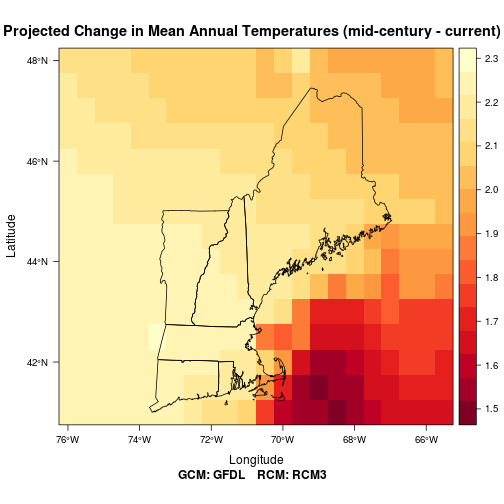
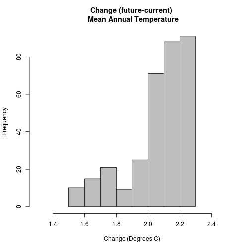
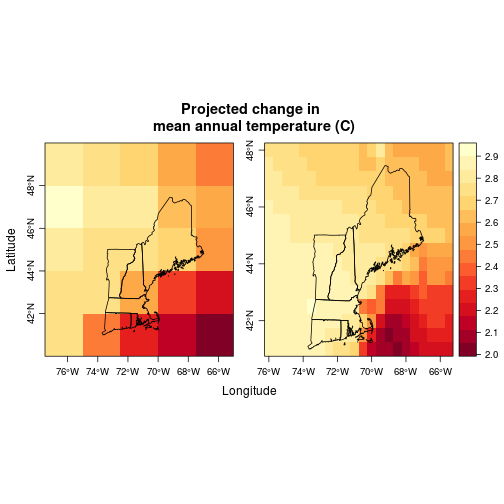
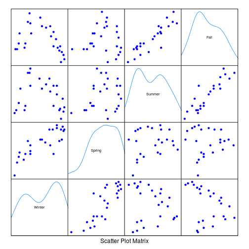

# Working with Climate Model Output
__________________

## Objective
To familiarize you with accessing and working with climate model output, in this exercise we'll compare the output from global climate models (GCMs) and regional climate models (RCMs). First, we'll work with data from the Geophysical Fluid Dynamics Laboratory (GFDL) GCM output and Regional Climate Model (RCM) output from NARCCAP and compare them.  We’ve selected the GFDL model as an example for today. 
[](http://www.gfdl.noaa.gov/brief-history-of-global-atmospheric-modeling-at-gfdl)

Here are a few relevant links:

* [Overview of the GFDL model](http://www.gfdl.noaa.gov/brief-history-of-global-atmospheric-modeling-at-gfdl)
* [NARCCAP website](http://www.gfdl.noaa.gov/brief-history-of-global-atmospheric-modeling-at-gfdl)


# Example integration of R and CDO for working with climate data
======


Explore the data for this exercise
-----------------

First, set the working directory and load libraries.

```r
setwd("/home/user/ost4sem/exercise/SpatialAnalysisTutorials/climate/RCM")
library(ncdf)
library(rasterVis)
library(sp)
library(rgdal)
library(reshape)
library(lattice)
library(xtable)
library(plyr)
```

If you get the error: Error in library(xx): there is no package called 'xx'
 then run the following for the missing package (replace ncdf with the package that is missing):
 install.packages("ncdf")
 and then re-run the lines above to load the newly installed libraries

Look at the files in the data directory:

```r
list.files("../data")
```

```
##  [1] "GFDL_Current.nc"             "GFDL_Future.nc"             
##  [3] "gfdl_RCM3_Current.nc"        "gfdl_RCM3_Future.nc"        
##  [5] "gfdl_RCM3_Future.nc.aux.xml" "NewEngland.dbf"             
##  [7] "NewEngland.prj"              "NewEngland.shp"             
##  [9] "NewEngland.shx"              "README.md"
```


If we had used the Earth System Fedaration Grid (ESFG) to generate a CMIP5 download script, we could download the data with it from R.  One disadvantage of RStudio is that the terminal (console) is 'wrapped' by Java, so some interactive terminal features don't work correctly.  In this case, the ESFG script must be provided with all parameters (inluding the openid) to download the files. To see the various options available for this, run it with the help flag:

```r
## Look at the help for the download script
system("bash ../CMIP5/wget-20131009120214.sh -h")
```


If you really wanted to download the data (and the server was working), you would have to supply your credentials.  For example, just to see how it works, let's tell it to bypass security and 'pretend' to download the data

```r
system("bash ../CMIP5/wget-20131009120214.sh -n -s")
```


##  Introduction to the Climate Data Operators [https://code.zmaw.de/projects/cdo]

Like other non-R programs (like GDAL, etc.), to run a CDO command from R, we have to 'wrap' it with a "system" call.  
Try this:

```r
system("cdo -V")
```


That command tells R to run the command "cdo -V" at the system level (at the linux prompt rather than R).
 "-V says you want to see what version of CDO you are have installed.
 If it worked, you should see a list of the various components of CDO
 and their version numbers and dates in the R console.

Let's take a closer look at one of those files using the "variable description" (VARDES) command:

```r
system("cdo vardes ../data/gfdl_RCM3_Future.nc")
```

note that there is a "../data/" command before the filename. This tells cdo to go up one level
in the directory tree, then go down into the data directory to find the file.  
Using relative paths like this allow the top-level folder to be moved without breaking links (even on other computers).

 What is the output?  What variables are in that file?
 You can also explore the file with panoply with this command:

```r
system("/usr/local/PanoplyJ/panoply.sh ../data/gfdl_RCM3_Future.nc &")
```

 
Adding the "&" on the end tells linux to start panoply and not wait for it to close/finish, but it remains a 'sub' process of R here, so if you close R, the panoply window will also die. See nohup [http://en.wikipedia.org/wiki/Nohup] for ways to spawn an independant process.

 CDO commands generally have the following syntax:  
 
 `cdo command inputfile outputfile `
 
 and create a new file (outputfile) that is the result of running the command on the inputfile.  Pretty easy, right?  

 What if you wanted to select one variable (selvar) and create a new file for further processing?  
 Try this:

```r
system("cdo selvar,tmean ../data/gfdl_RCM3_Future.nc gfdl_RCM3_Future_tmean.nc")
```


 Now inspect the resulting file (gfdl_RCM3_Future_tmean.nc) with Panoply:

```r
system("/usr/local/PanoplyJ/panoply.sh gfdl_RCM3_Future_tmean.nc &")
```

or using the vardes command above.  You can open additional files using the panoply menus.  What's different about it?  Can you guess what the selvar command does?  

 One powerful feature of the CDO tools is the ability to string together commands to perform multiple operations at once.  You just have to add a dash ("-") before any subsequent commands.  The inner-most commands are run first. If you have a multi-core processor, these separate commands will be run in parallel if possible (up to 128 threads).  This comes in 
 handy when you are working with hundreds of GB of data.  Now convert the daily data  to mean annual temperature with the following command:

```r
system("cdo timmean -selvar,tmean ../data/gfdl_RCM3_Future.nc gfdl_RCM3_Future_mat.nc")
```


 That command:
 * first uses selvar to subset only tmean (mean temperatures), 
 * uses timmean to take the average over the entire 'future' timeseries.

Now explore the new file (gfdl_RCM3_Future_mat.nc) with Panoply.
* How many time steps does it have?
* What do the values represent?


```r
system("/usr/local/PanoplyJ/panoply.sh gfdl_RCM3_Future_mat.nc &")
```


 Now calculate the same thing (mean annual temperature) from the model output for the "Current" 
 time period:

```r
system("cdo timmean -selvar,tmean ../data/gfdl_RCM3_Current.nc gfdl_RCM3_Current_mat.nc")
```


 And calculate the difference between them:

```r
system("cdo sub gfdl_RCM3_Future_mat.nc gfdl_RCM3_Current_mat.nc gfdl_RCM3_mat_dif.nc")
```

Look at this file in Panoply.  
 * How much (mean annual) temperature change is projected for this model?


```r
system("/usr/local/PanoplyJ/panoply.sh gfdl_RCM3_mat_dif.nc &")
```


Or you can string the commands above together and do all of the previous  operations in one step with the following command  (and if you have a dual core - or more - processor it will use all of them, isn't that cool!):

```r
system("cdo sub -timmean -selvar,tmean ../data/gfdl_RCM3_Future.nc -timmean -selvar,tmean ../data/gfdl_RCM3_Current.nc gfdl_RCM3_mat_dif.nc")
```


Now load these summarized data into R as a 'raster' class (defined by the raster library) 
 using the raster package which allows you to read directly from a netcdf file.
 You could also use the rgdal package if it has netcdf support (which it doesn't by default in windows)

```r
mat_dif = raster("gfdl_RCM3_mat_dif.nc", varname = "tmean", band = 1)
```


Also load a polygon (shapefile) of New England to overlay on the grid so you know what you are looking at
 the shapefile has polygons, but since we just want this for an overlay, let's convert to lines as well

```r
ne = as(readOGR("../data/NewEngland.shp", "NewEngland"), "SpatialLines")
```

```
## OGR data source with driver: ESRI Shapefile 
## Source: "../data/NewEngland.shp", layer: "NewEngland"
## with 6 features and 7 fields
## Feature type: wkbPolygon with 2 dimensions
```


Take a look at the data:

```r
levelplot(mat_dif, margin = F, main = "Projected Change in Mean Annual Temperatures (mid-century - current)", 
    sub = "GCM: GFDL    RCM: RCM3") + layer(sp.lines(ne))
```

 


Questions:
* So how much does that model say it will warm by mid-century?  
* What patterns do you see at this grain?
* Any difference between water and land?
* Why would this be?

 The previous plot shows the information over space, but how about a distribution of values:

```r
hist(mat_dif, col = "grey", main = "Change (future-current) \n Mean Annual Temperature", 
    xlab = "Change (Degrees C)", xlim = c(1.3, 2.5))
```

 


 We now need to calculate the change in mean annual temp and precipitation in the GCM output.

```r
system("cdo sub -timmean ../data/GFDL_Future.nc -timmean ../data/GFDL_Current.nc GFDL_dif.nc")
```

You might see some warnings about missing "scanVarAttributes", this is due to how IRI writes it's netCDF files
 in this example we don't need to worry about them


## Comparison of RCM & GCM output
_____________________________________________

Calculate the mean change (future-current) for all the variables in the GFDL_RCM3 dataset (tmin, tmax, tmean, and precipitation) like we did for just temperature above (Hint: do them one by one or simply don't subset a variable). After you run the command, check the output file with Panoply to check that it has the correct number of variables and only one time step.


```r
system("cdo sub -timmean ../data/gfdl_RCM3_Future.nc -timmean ../data/gfdl_RCM3_Current.nc GFDL_RCM3_dif.nc")
```


Let's compare the Global Climate Model (GCM) and Regional Climate Model (RCM) data and resolutions by plotting them.  First we need to read them in.  Let's use the raster package again:

```r
gcm = brick(raster("GFDL_dif.nc", varname = "tmean"), raster("GFDL_dif.nc", 
    varname = "ptot"))
rcm = brick(raster("GFDL_RCM3_dif.nc", varname = "tmean"), raster("GFDL_RCM3_dif.nc", 
    varname = "ptot"))
```


It would be nice if we could combine the two model types in a single two-panel plot with common color-bar to facilitate comparison.  For understandable reasons, it's not possible to merge rasters of different resolutions as a single raster stack or brick object.  But you can combine the plots easily with functions in the rasterVis/latticeExtra packages like this:

```r
c(levelplot(gcm[[1]], margin = F, main = "Projected change in \n mean annual temperature (C)"), 
    levelplot(rcm[[1]], margin = F)) + layer(sp.lines(ne))
```

 

```r

c(levelplot(gcm[[2]], margin = F, main = "Projected change in \n mean annual precipitation (mm)"), 
    levelplot(rcm[[2]], margin = F)) + layer(sp.lines(ne))
```

 


* Do you see differences in patterns or absolute values?
* How do you think the differences in resolution would affect analysis of biological/anthropological data?
* Is the increased resolution useful?

### Calculate the mean change BY SEASON for all the variables in the GFDL_RCM3 dataset
The desired output will be a netcdf file with 4 time steps, the mean change for each of the 4 seasons.
  

```r
system("cdo sub -yseasmean ../data/GFDL_Future.nc -yseasmean ../data/GFDL_Current.nc  gfdl_seasdif.nc")
```


Read the file into R using the 'brick' command to read in all 4 time steps from tmean as separate raster images.  Then update update the column names (to spring, summer, etc.) and plot the change in each of the four seasons.


```r
difseas = brick("gfdl_seasdif.nc", varname = "tmean", band = 1:4)
names(difseas) = c("Winter", "Spring", "Summer", "Fall")
## and make a plot of the differences
levelplot(difseas, col.regions = rev(heat.colors(20))) + layer(sp.lines(ne))
```

 


Which season is going to warm the most?
Let's marginalize across space and look at the data in a few different ways:
* density plot (like a histogram) with the four seasons.
* "violin" plot

```r
densityplot(difseas, auto.key = T, xlab = "Temperature Change (C)")
```

 

```r
bwplot(difseas, ylab = "Temperature Change (C)", xlab = "Season", scales = list(y = list(lim = c(1, 
    5))))
```

 


We can also look at the relationship between variables with a scatterplot matrix:

```r
splom(difseas, colramp = colorRampPalette("blue"))
```

 


Or with a tabular correlation matrix:

```r
layerStats(difseas, stat = "pearson")[[1]]
```

If we want that table in the summary document, we have to use xtable to format it correctly:

```r
print(xtable(layerStats(difseas, stat = "pearson")[[1]], caption = "Pearson Correlation between seasonal change", 
    digits = 3), type = "html")
```

<!-- html table generated in R 3.0.1 by xtable 1.7-1 package -->
<!-- Tue Oct  8 11:51:37 2013 -->
<TABLE border=1>
<CAPTION ALIGN="bottom"> Pearson Correlation between seasonal change </CAPTION>
<TR> <TH>  </TH> <TH> Winter </TH> <TH> Spring </TH> <TH> Summer </TH> <TH> Fall </TH>  </TR>
  <TR> <TD align="right"> Winter </TD> <TD align="right"> 1.000 </TD> <TD align="right"> 0.835 </TD> <TD align="right"> -0.164 </TD> <TD align="right"> -0.348 </TD> </TR>
  <TR> <TD align="right"> Spring </TD> <TD align="right"> 0.835 </TD> <TD align="right"> 1.000 </TD> <TD align="right"> 0.229 </TD> <TD align="right"> 0.002 </TD> </TR>
  <TR> <TD align="right"> Summer </TD> <TD align="right"> -0.164 </TD> <TD align="right"> 0.229 </TD> <TD align="right"> 1.000 </TD> <TD align="right"> 0.899 </TD> </TR>
  <TR> <TD align="right"> Fall </TD> <TD align="right"> -0.348 </TD> <TD align="right"> 0.002 </TD> <TD align="right"> 0.899 </TD> <TD align="right"> 1.000 </TD> </TR>
   </TABLE>


