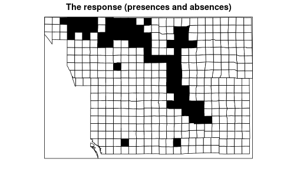
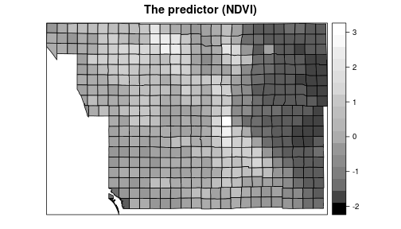
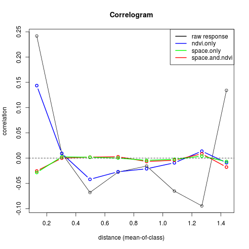

Spatially-explicit logistic regression
======================================

### Goal of this class

To demonstrate a simple presence/absence modelling in spatial context. To model spatial     dependence (autocorrelation) in the response. 
  
  Overview of [R's spatial toolset is here](http://cran.r-project.org/web/views/Spatial.html).
  
### What is spatial autocorrelation?
  
Today we will model space by **smooth splines** in ```mgcv``` package. 
  
Examples of Alternative approaches:
  - Simple polynomials
  - Eigenvector Mapping: ```vegan```, ```spdep```
  - Predictive process: ```spbayes```
  
Methods that tweak variance-covariance matrix of **Multivariate Normal Distribution**:
  - Generalized Least Squares: ```MASS```, ```nlme```
  - Autoregressive Models: ```spdep```
  - GeoBUGS module in OpenBUGS
  
See Dormann et al. 2007 Ecography, 30: 609-628 for a review.

### The object of modelling

Purple finch (Carpodacus purpureus) (source: Wikipedia) in San Diego county, California:


Preparing the data
------------------

First we load the necessary packages:

```r
library(rgdal)
library(sp)  # handles spatial data
library(mgcv)  # package for Generalized Additive Models
library(colorRamps)  # for pretty MatLab-like colors
library(ncf)  # has an easy function for correlograms
```


Load a vector dataset (shapefile) representing the San Diego bird atlas data for Purple finch:

```r
finch <- readOGR("finch", layer = "finch")
```

```
## OGR data source with driver: ESRI Shapefile 
## Source: "finch", layer: "finch"
## with 414 features and 26 fields
## Feature type: wkbPolygon with 2 dimensions
```


Check how R handles vector data using the structure (```str```) command to look at one of the polygons:

```r
str(finch[1, ])
```

```
## Formal class 'SpatialPolygonsDataFrame' [package "sp"] with 5 slots
##   ..@ data       :'data.frame':	1 obs. of  26 variables:
##   .. ..$ RC        : Factor w/ 414 levels "C-10","C-11",..: 27
##   .. ..$ FID_ATLAS1: num 0
##   .. ..$ AREA      : num 2.14e+08
##   .. ..$ ID_COARSE : Factor w/ 46 levels "c1","c10","c11",..: 1
##   .. ..$ FID_ATLA_1: num 11
##   .. ..$ AREA_1    : num 24584734
##   .. ..$ PERIMETER : num 19800
##   .. ..$ BIRD_ATLAS: num 13
##   .. ..$ BIRD_ATL_1: num 13
##   .. ..$ TRQ       : Factor w/ 396 levels "T09R1ENE","T09R1ESE",..: 19
##   .. ..$ BLOCKNAME : Factor w/ 395 levels "Agra","Agua Caliente",..: 286
##   .. ..$ area_mdm  : num 24584493
##   .. ..$ X_CEN     : num -117
##   .. ..$ Y_CEN     : num 33.4
##   .. ..$ ndvi      : num 129
##   .. ..$ meanelev  : num 337
##   .. ..$ minelev   : num 156
##   .. ..$ maxelev   : num 560
##   .. ..$ vegtypes  : int 19
##   .. ..$ maxtmp    : num 32.4
##   .. ..$ mintmp    : num 4.21
##   .. ..$ meanppt   : num 319
##   .. ..$ summert   : num 23.3
##   .. ..$ wintert   : num 11.7
##   .. ..$ urban     : num 10.5
##   .. ..$ present   : num 1
##   ..@ polygons   :List of 1
##   .. ..$ :Formal class 'Polygons' [package "sp"] with 5 slots
##   .. .. .. ..@ Polygons :List of 1
##   .. .. .. .. ..$ :Formal class 'Polygon' [package "sp"] with 5 slots
##   .. .. .. .. .. .. ..@ labpt  : num [1:2] 484697 3696562
##   .. .. .. .. .. .. ..@ area   : num 24584493
##   .. .. .. .. .. .. ..@ hole   : logi FALSE
##   .. .. .. .. .. .. ..@ ringDir: int 1
##   .. .. .. .. .. .. ..@ coords : num [1:37, 1:2] 487191 487167 487149 487153 486763 ...
##   .. .. .. ..@ plotOrder: int 1
##   .. .. .. ..@ labpt    : num [1:2] 484697 3696562
##   .. .. .. ..@ ID       : chr "0"
##   .. .. .. ..@ area     : num 24584493
##   ..@ plotOrder  : int 1
##   ..@ bbox       : num [1:2, 1:2] 482186 3694052 487191 3699070
##   .. ..- attr(*, "dimnames")=List of 2
##   .. .. ..$ : chr [1:2] "x" "y"
##   .. .. ..$ : chr [1:2] "min" "max"
##   ..@ proj4string:Formal class 'CRS' [package "sp"] with 1 slots
##   .. .. ..@ projargs: chr NA
```

Now look at the associated data frame (analogous to the *.dbf file that accompanied the shapefile):

```r
head(finch@data)
```

```
##     RC FID_ATLAS1      AREA ID_COARSE FID_ATLA_1   AREA_1 PERIMETER
## 0  C-9          0 214130000        c1         11 24584734     19800
## 1 C-10          0 214130000        c1         12 23355580     19452
## 2 C-11          0 214130000        c1         22 23534602     19301
## 3 D-10          0 214130000        c1         43 24535492     19735
## 4 D-11          0 214130000        c1         45 23853714     19508
## 5  D-9          0 214130000        c1         46 23849098     19561
##   BIRD_ATLAS BIRD_ATL_1      TRQ      BLOCKNAME area_mdm  X_CEN Y_CEN
## 0         13         13 T09R3WNE        Rainbow 24584493 -117.2 33.41
## 1         14         14 T09R2WNW    Mt. Olympus 23355572 -117.1 33.40
## 2         24         24 T09R2WNE Trujillo Creek 23534551 -117.0 33.40
## 3         45         45 T09R2WSW    Gomez Creek 24535492 -117.1 33.36
## 4         47         47 T09R2WSE           Pala 23853715 -117.0 33.36
## 5         48         48 T09R3WSE  Monserate Mt. 23849098 -117.2 33.36
##    ndvi meanelev minelev maxelev vegtypes maxtmp mintmp meanppt summert
## 0 129.4    336.6  155.84   560.3       19  32.35   4.21   318.7   23.32
## 1 123.2    470.0  173.03   675.8       16  32.30   3.64   346.1   23.35
## 2 123.2    498.7  159.22  1008.6       22  32.88   3.55   342.9   23.58
## 3 128.0    244.2   87.45   552.7       25  32.88   4.57   301.7   23.58
## 4 112.5    228.6  110.70   611.5       27  33.55   4.75   292.6   24.08
## 5 142.1    208.3   82.69   471.4       23  32.47   4.93   288.1   23.17
##   wintert urban present
## 0   11.68 10.48       1
## 1   10.95  1.98       0
## 2   10.94  0.83       1
## 3   12.19  1.17       0
## 4   12.36  8.55       1
## 5   12.37 12.26       1
```


Scaling and centering the environmental variables to zero mean and variance of 1, using the ```scale``` function:

```r
envi <- finch@data[, 15:25]
envi.scaled <- as.numeric(scale(envi))
finch@data[, 15:25] <- envi.scaled
```


Plotting the response (presence/absence data) and the predictor (NDVI):

```r
spplot(finch, zcol = c("present"), col.regions = c("white", "black"), colorkey = FALSE, 
    main = "The response (presences and absences)")
```

 

```r
spplot(finch, zcol = c("ndvi"), col.regions = grey.colors(20, start = 0, end = 1), 
    main = "The predictor (NDVI)")
```

 


Fitting the models
------------------

### Model 1 - only NDVI

Now we will do the actual modelling. The first simple model links the presences and absences to NDVI.

First, we will fit model a model that only uses NDVI as a predictor of presence and absence:

$\log ( \frac{p_i}{1-p_i} ) = \beta_0 + \beta_1 NDVI_i$

$o_i \sim Bernoulli(p_i)$

It can be fitted by simple glm() in R:

```r
ndvi.only <- glm(present ~ ndvi, data = finch@data, family = "binomial")
summary(ndvi.only)
```

```
## 
## Call:
## glm(formula = present ~ ndvi, family = "binomial", data = finch@data)
## 
## Deviance Residuals: 
##     Min       1Q   Median       3Q      Max  
## -1.8376  -0.4842  -0.2227  -0.0439   2.6604  
## 
## Coefficients:
##             Estimate Std. Error z value Pr(>|z|)    
## (Intercept)   -2.939      0.296   -9.93   <2e-16 ***
## ndvi           2.652      0.322    8.23   <2e-16 ***
## ---
## Signif. codes:  0 '***' 0.001 '**' 0.01 '*' 0.05 '.' 0.1 ' ' 1
## 
## (Dispersion parameter for binomial family taken to be 1)
## 
##     Null deviance: 385.67  on 413  degrees of freedom
## Residual deviance: 228.61  on 412  degrees of freedom
## AIC: 232.6
## 
## Number of Fisher Scoring iterations: 6
```

```r
## and let's extract predictions and residuals:
preds.ndvi.only <- predict(ndvi.only, type = "response")
resid.ndvi.only <- residuals(ndvi.only)
```


Now let's plot the logistic curve:

```r
newx <- data.frame(ndvi = seq(-2, 3, by = 0.1))
newy <- predict(ndvi.only, newdata = newx, type = "response")
plot(newx[, 1], newy, type = "l", xlab = "(Scaled) NDVI", ylab = "P of presence", 
    col = "red")
points(finch@data$ndvi, finch@data$present)
```

 


### Model 2 - only space

The second model fits only the spatial trend in the data (using GAM and splines):

```r
space.only <- gam(present ~ s(X_CEN, Y_CEN), data = finch@data, family = "binomial")
```

```
## Warning: the matrix is either rank-deficient or indefinite
```

```r
summary(space.only)
```

```
## 
## Family: binomial 
## Link function: logit 
## 
## Formula:
## present ~ s(X_CEN, Y_CEN)
## 
## Parametric coefficients:
##             Estimate Std. Error z value Pr(>|z|)   
## (Intercept)    -84.3       29.0   -2.91   0.0036 **
## ---
## Signif. codes:  0 '***' 0.001 '**' 0.01 '*' 0.05 '.' 0.1 ' ' 1
## 
## Approximate significance of smooth terms:
##                 edf Ref.df Chi.sq p-value   
## s(X_CEN,Y_CEN) 28.8     29   51.2  0.0067 **
## ---
## Signif. codes:  0 '***' 0.001 '**' 0.01 '*' 0.05 '.' 0.1 ' ' 1
## 
## R-sq.(adj) =  0.645   Deviance explained = 67.8%
## UBRE score = -0.55616  Scale est. = 1         n = 414
```

```r
## extracting predictions
preds.space.only <- predict(space.only, type = "response")
resid.space.only <- residuals(space.only)
```


### Model 3 - space and NDVI

The third model uses both the NDVI and spatial trends to explain the finch's occurrences:

```r
space.and.ndvi <- gam(present ~ ndvi + s(X_CEN, Y_CEN), data = finch@data, family = "binomial")
```

```
## Warning: the matrix is either rank-deficient or indefinite
```

```r
summary(space.and.ndvi)
```

```
## 
## Family: binomial 
## Link function: logit 
## 
## Formula:
## present ~ ndvi + s(X_CEN, Y_CEN)
## 
## Parametric coefficients:
##             Estimate Std. Error z value Pr(>|z|)    
## (Intercept)    -5.92       2.08   -2.84   0.0044 ** 
## ndvi            2.65       0.57    4.66  3.2e-06 ***
## ---
## Signif. codes:  0 '***' 0.001 '**' 0.01 '*' 0.05 '.' 0.1 ' ' 1
## 
## Approximate significance of smooth terms:
##                 edf Ref.df Chi.sq p-value   
## s(X_CEN,Y_CEN) 23.4   25.8   47.7  0.0055 **
## ---
## Signif. codes:  0 '***' 0.001 '**' 0.01 '*' 0.05 '.' 0.1 ' ' 1
## 
## R-sq.(adj) =  0.687   Deviance explained = 70.2%
## UBRE score = -0.59956  Scale est. = 1         n = 414
```

```r
## extracting predictions and residuals:
preds.space.and.ndvi <- predict(space.and.ndvi, type = "response")
resid.space.and.ndvi <- residuals(space.and.ndvi)
```


Examining the fitted models
---------------------------

Now let's put all of the predictions together:

```r
predictions <- data.frame(RC = finch@data$RC, preds.ndvi.only, resid.ndvi.only, 
    preds.space.only, preds.space.and.ndvi, resid.space.and.ndvi, resid.space.only)
finch.preds <- merge(finch, predictions, by = "RC")
```


And we plot the predictions of the three models, together with the actual observed presences and absences:

```r
spplot(finch.preds, zcol = c("present", "preds.ndvi.only", "preds.space.only", 
    "preds.space.and.ndvi"), col.regions = matlab.like2(50))
```

 


We can compare AIC values the models:

```r
AIC(ndvi.only, space.only, space.and.ndvi)
```

```
##                   df   AIC
## ndvi.only       2.00 232.6
## space.only     29.83 183.8
## space.and.ndvi 25.35 165.8
```


We can also plot the ***partial residual plots*** of the best model (similar to function ```termplot``` in the ```stats``` package):

```r
plot.gam(space.and.ndvi, se = FALSE, all.terms = TRUE, pages = 1, pers = FALSE)
```

 


It is always useful to check the magnitude of spatial correlation in residuals. We will use the function ```correlog``` from the ```ncf``` package. An overview of other [functions that plot correlograms is here.](http://www.petrkeil.com/?p=1050).

```r
presence.absence.cor <- correlog(finch@data$X_CEN, finch@data$Y_CEN, finch@data$present, 
    increment = 0.2, resamp = 1)
```

```
## 1  of  1
```

```r
ndvi.only.cor <- correlog(finch.preds@data$X_CEN, finch.preds@data$Y_CEN, finch.preds@data$resid.ndvi.only, 
    increment = 0.2, resamp = 1)
```

```
## 1  of  1
```

```r
space.only.cor <- correlog(finch.preds@data$X_CEN, finch.preds@data$Y_CEN, finch.preds@data$resid.space.only, 
    increment = 0.2, resamp = 1)
```

```
## 1  of  1
```

```r

space.and.envi.cor <- correlog(finch.preds@data$X_CEN, finch.preds@data$Y_CEN, 
    finch.preds@data$resid.space.and.ndvi, increment = 0.2, resamp = 1)
```

```
## 1  of  1
```


And we can plot the correlograms:

```r
plot(presence.absence.cor, col = "green", lwd = 2)
points(ndvi.only.cor$mean.of.class, ndvi.only.cor$correlation, type = "b", col = "blue", 
    lwd = 2)
points(space.and.envi.cor$mean.of.class, space.and.envi.cor$correlation, col = "red", 
    type = "b", lwd = 2)
points(space.only.cor$mean.of.class, space.only.cor$correlation, col = "green", 
    type = "b", lwd = 2)
abline(h = 0, lty = 2)
legend("topright", legend = c("raw response", "ndvi.only", "space.only", "space.and.ndvi"), 
    col = c("black", "blue", "green", "red"), lwd = c(2, 2, 2))
```

 


What did we gain by making the model ``spatially explicit''?
------------------------------------------------------------

- We know that the effect of NDVI is not artificially amplified by pseudoreplication.
- We have more realistic predictions.
- We have a fitted surface that can be interpreted -- perhaps to guide us towards some additional spatially-structured predictors that can be important.

