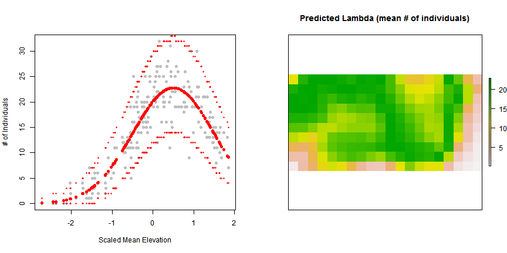
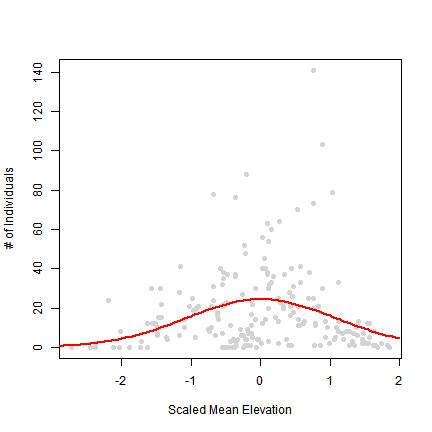
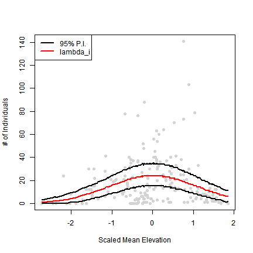

Poisson log-linear regression - fitted by glm(), maximum likelihood, and MCMC
=============================================================================

The goal of this post is to demonstrate how a simple statistical model (Poisson log-linear regression) can be fitted using three different approaches. I want to demonstrate that both frequentists and Bayesians use the same models, and that it is the fitting procedure and the inference that differs. This is also for those who understand the likelihood methods and do not have a clue about MCMC, and vice versa. I use an ecological dataset for the demonstration.

The complete code of this post is available [here on GitHub](https://github.com/petrkeil/Statistics/tree/master/Poisson_regression)

-------

The data
========  
  
I will use the data on the distribution of 3605 individual trees of *Beilschmiedia pendula* in 50-ha (500 x 1000 m) forest plot in Barro Colorado (Panama). The dataset is freely available as a part of the R's `spatstat` library. 

First, I will load the necessary libraries:

```r
library(spatstat)
library(raster)
library(sp)
```


Let's plot the spatial distribution of the individuals in the plot:

```r
plot(bei$x, bei$y, pch = 19, cex = 0.5, main = "Spatial distribution of individuals in the 50-ha Barro Colorado plot", 
    xlab = "x coordinate [m]", ylab = "y coordinate [m]", frame = FALSE)
abline(h = 0, col = "grey")
abline(h = 500, col = "grey")
abline(v = 0, col = "grey")
abline(v = 1000, col = "grey")
```

 


The dataset also comes with two rasterized environmental layers: elevation and slope.  My goal will be to model density of tree individuals as a function of elevation [meters above sea level]. I am interested in predicting density of the trees (i.e. number **n** of individuals per unit area). Hence, I will resample the data into a grid of 50 x 50 m:

```r
# coarsening the predictor data into the 50 x 50 m grid by taking the mean
# of the 5 x 5 m grid cells:
elev <- raster(bei.extra[[1]])
# cropping the data so that they have exactly 500 x 1000 cells
ext <- extent(2.5, 1002.5, 2.5, 1002.5)
elev <- crop(elev, ext)
# aggregating the elevation data
elev50 <- aggregate(elev, fact = 10, fun = mean)

# fitting the point data into the 40 x 40 m grid
xy <- data.frame(x = bei$x, y = bei$y)
n50 <- rasterize(xy, elev50, fun = "count")
# replacing the NA values by 0
n50[is.na(n50)] <- 0
```


### Initial data visualization 
  
Initial plotting of the data is the necessary first step in any data analysis. So let's first plot the gridded data:

```r
plot(stack(elev50, n50), main = c("Predictor: Mean Elevation in 50x50 m cells", 
    "Response: # of Individuals in 50x50 m cells"), axes = FALSE)
```

 


Now let's see how the predictor and the response look plotted against each other. 

```r
plot(elev50[], n50[], cex = 1, pch = 19, col = "grey", ylab = "# of Individuals", 
    xlab = "Mean Elevation [m]")
```

 

There seems to be a unimodal response of # of individuals to elevation. For this reason I will use a polynomial function rather than the simplest (linear) function to model the response. Also, you can see that the variability of the data increases in intermediate elevations, and I also note that this is count data -- it makes it an excellent candidate for Poisson error structure (the larger the mean the larger the variance), or maybe even Negative-binomial error structure (not considered in this post). 

### Centering and standardization
   
I find it necessary to center (to 0 mean) and standardize (to variance of 1) variables for MCMC simulations and for likelihood optimization. For models with log link function it really is essential --  it makes any algorithm opearting in log-space much more effective. Here I will define my own function ```scale2()```, but you can also use the R's native ```scale()```: 

```r
scale2 <- function(x) {
    sdx <- sqrt(var(x))
    meanx <- mean(x)
    return((x - meanx)/sdx)
}

elev50 <- scale2(elev50[])
```


Finally, some minor tweakings:

```r
pow.elev50 <- elev50^2  # (I will be fitting a polynomial)
n50 <- n50[]
```


-------

The model
=========  
   
This is the formal definition of the model that I am going to use: 

$\log \lambda_i = \beta_0 + \beta_1 Elevation_i + \beta_2 Elevation_i^2$

$n_i \sim Poisson(\lambda_i)$

The index $i$ identifies each grid cell (data point). $\beta_0$ - $\beta_2$ are model coefficients, and $n_i$ is the observed number of individuals in each grid cell.

The notation roughly reads as: The logarithm of $\lambda_i$ is a function of the elevation and the regression coefficients. The observed numbers of individuals in each grid cell is an outcome of a Poisson-distributed random process with cell-specific parameter $\lambda_i$.

I recommend to write down such formal definition of any statistical model that you are going to use. It will tell you everything about its assumptions and it will be easier to interpret the fitted model.

-------

Fitting the model using glm()
=============================  
   
Fitting my model with the ```glm()``` function is easy. You just need to specify that the data are drawn from Poisson distribution and that $\lambda_i$ is modelled in logarithmic space. Specifying ```family="poisson"``` will do exactly that:

```r
m.glm <- glm(n50 ~ elev50 + pow.elev50, family = "poisson")
summary(m.glm)
```

```
## 
## Call:
## glm(formula = n50 ~ elev50 + pow.elev50, family = "poisson")
## 
## Deviance Residuals: 
##    Min      1Q  Median      3Q     Max  
##  -6.98   -3.28   -1.40    1.32   17.87  
## 
## Coefficients:
##             Estimate Std. Error z value Pr(>|z|)    
## (Intercept)  3.19436    0.02032   157.2   <2e-16 ***
## elev50       0.00441    0.02255     0.2     0.84    
## pow.elev50  -0.42186    0.02085   -20.2   <2e-16 ***
## ---
## Signif. codes:  0 '***' 0.001 '**' 0.01 '*' 0.05 '.' 0.1 ' ' 1
## 
## (Dispersion parameter for poisson family taken to be 1)
## 
##     Null deviance: 3953.0  on 199  degrees of freedom
## Residual deviance: 3391.3  on 197  degrees of freedom
## AIC: 4170
## 
## Number of Fisher Scoring iterations: 5
```


I will then use the fitted model to make a smooth prediction curve of $\lambda_i$:

```r
elev.seq <- seq(-3, 2, by = 0.05)
new.data <- data.frame(elev50 = elev.seq, pow.elev50 = elev.seq^2)
new.predict <- predict(m.glm, newdata = new.data, type = "response")
```


And here I plot the data and the predicted $\lambda_i$ (red line):

```r
plot(elev50, n50, cex = 1, col = "lightgrey", pch = 19, ylab = "# of Individuals", 
    xlab = "Scaled Mean Elevation")
lines(elev.seq, new.predict, col = "red", lwd = 2)
```

 


### Advantages of glm()  
- Fast.
- Simple.
- It immediately gives you AIC, SEs, R^2 and the other cool stuff.
- It works well even on relatively big data.

### Disadvantages of glm()  
- Not very flexible.
- It is tricky to pull out prediction intervals. In my case I could use some combination of bootstrap and ```qpois()```, but it would get quite messy in any case.


-------

  
Fitting the model by maximum likelihood
=======================================  
  
First, I will define the log-likelihood function for the polynomial Poisson regression: 

```r
LogLike <- function(dat, par) {
    beta0 <- par[1]
    beta1 <- par[2]
    beta2 <- par[3]
    # the deterministic part of the model:
    lambda <- exp(beta0 + beta1 * dat$x + beta2 * (dat$x^2))
    # and here comes the negative log-likelihood of the whole dataset, given the
    # model:
    LL <- -sum(dpois(dat$y, lambda, log = TRUE))
    return(LL)
}
```


Then I need to set the initial values for the optimization procedure:

```r
beta0 <- rnorm(1)
beta1 <- rnorm(1)
beta2 <- rnorm(1)
par <- c(beta0, beta1, beta2)
```


I will coerce my data for my ```LogLike()``` function:

```r
dat <- data.frame(y = n50, x = elev50)
```


And now I can run the likelihood maximization using the ```optim()``` function.

```r
m.like <- optim(par = par, fn = LogLike, dat = dat)
m.like
```

```
## $par
## [1]  3.194198  0.004315 -0.421811
## 
## $value
## [1] 2082
## 
## $counts
## function gradient 
##      102       NA 
## 
## $convergence
## [1] 0
## 
## $message
## NULL
```

Note: I am using the scaled (to zero mean and unit variance) predictor ```elev50```. This is vital in case you are using a GLM with log link function. If you try to run the ```optim()``` function on raw (non-scaled) data, it won't work. 

And finally, plotting the data and the fitted model:

```r
plot(elev50, n50, cex = 1, col = "lightgrey", pch = 19, ylab = "# of Individuals", 
    xlab = "Scaled Mean Elevation")
new.predict <- exp(m.like$par[1] + m.like$par[2] * elev.seq + m.like$par[3] * 
    (elev.seq^2))
lines(elev.seq, new.predict, col = "red", lwd = 2)
```

 

  
### Advantages of likelihood optimization
- More flexible than ```glm()``` - you can modify your models as much as you want and you will be able to fit them.
- Often faster than MCMC.
  
### Disadvantages of likelihood optimization
- The optimization algorithm may crash, or it can get stuck at a local optimum.
- Difficult to get prediction intervals (or any measure of uncertainty).
  
  
-------

Fitting the model by MCMC in JAGS
=================================  
  
MCMC stands for Markov Chain Monte Carlo sampling. It can be used to estimate posterior distributions of model parameters (i.e. to "fit a model") in a Bayesian setting. The most common flavors of MCMC are Metropolis-Hastings algorithm and Gibbs sampling.
I will use the MCMC sampler in [JAGS](http://mcmc-jags.sourceforge.net/) to fit the model, which in R is accessed conveniently through the ```rjags``` library:

```r
library(rjags)
```


Now I will create the ```list``` data for JAGS:

```r
jags.data <- list(N.cells = length(n50), n50 = n50, elev50 = elev50)
```


And this is the model written in the JAGS (BUGS) language, which is very similar to R, but it is not the same:

```r
cat("\n      model\n      {\n        # priors\n        beta0 ~ dnorm(0,0.001)\n        beta1 ~ dnorm(0,0.001)\n        beta2 ~ dnorm(0,0.001)\n        \n        # likelihood\n        for(i in 1:N.cells)\n        {\n          n50[i] ~ dpois(lambda[i])\n          log(lambda[i]) <- beta0 + beta1*elev50[i] + beta2*pow(elev50[i],2)\n          # this part is here in order to make nice prediction curves:\n          prediction[i] ~ dpois(lambda[i])\n        } \n      }\n  ", 
    file = "model.txt")
```

I have actually dumped the code into a file.

Here I specify the parameters that will be monitored during the MCMC sampling:

```r
params <- c("beta0", "beta1", "beta2", "prediction")
```


Compiling the model:

```r
jm <- jags.model("model.txt", data = jags.data, n.chains = 3, n.adapt = 1000)
```

```
## Compiling model graph
##    Resolving undeclared variables
##    Allocating nodes
##    Graph Size: 1607
## 
## Initializing model
```


You usually need to throw away the initial samples (the so-called "burn-in" phase):

```r
update(jm, n.iter = 1000)
```


And here I am sampling from the posteriors and I am saving the samples for inference:

```r
jm.sample <- jags.samples(jm, variable.names = params, n.iter = 1000, thin = 1)
```


I can plot the Markov chains of the three regression coefficients, and their posterior density plots which are marginal distributions of the chains:

```r
plot(as.mcmc.list(jm.sample$beta0), main = "Beta_0")
```

 

```r
plot(as.mcmc.list(jm.sample$beta1), main = "Beta_1")
```

 

```r
plot(as.mcmc.list(jm.sample$beta2), main = "Beta_2")
```

 


Here I pull out a summary for an individual parameter, e.g. $\beta_2$:

```r
summary(as.mcmc.list(jm.sample$beta2))
```

```
## 
## Iterations = 1:1000
## Thinning interval = 1 
## Number of chains = 3 
## Sample size per chain = 1000 
## 
## 1. Empirical mean and standard deviation for each variable,
##    plus standard error of the mean:
## 
##           Mean             SD       Naive SE Time-series SE 
##      -0.423909       0.020753       0.000379       0.000675 
## 
## 2. Quantiles for each variable:
## 
##   2.5%    25%    50%    75%  97.5% 
## -0.464 -0.438 -0.423 -0.410 -0.385
```


I pull out the predictions and the 95% Prediction Intervals:

```r
predictions <- summary(as.mcmc.list(jm.sample$prediction))
prds <- data.frame(sc50 = scale2(elev50), predictions$quantiles)
prds <- prds[order(prds[, 1]), ]
```


And here I plot it all:

```r
plot(scale2(elev50), n50, cex = 1, col = "lightgrey", pch = 19, ylab = "# of Individuals", 
    xlab = "Scaled Mean Elevation")
lines(prds[, 1], prds[, 2], lwd = 2)
lines(prds[, 1], prds[, 4], lwd = 2, col = "red")
lines(prds[, 1], prds[, 6], lwd = 2)

legend("topleft", legend = c("95% P.I.", "lambda_i"), col = c("black", "red"), 
    lwd = c(2, 2))
```

 


You can see that the estimated parameter values very well match those from ```glm()``` and from the ML optimization. The striking result is that the data are clearly over-dispersed. Prediction intervals are really good at showing that -- the data simply spread a lot out of the black P.I. boundaries. 
  
### Advantages of MCMC 
- Flexible - you can modify your models as much as you want and still effectively fit them.
- Reliable. It will never get stuck on a local optimum.
- Great in pulling out uncertainties of all kinds (e.g. in the form of Prediction Intervals).
- Even though the MCMC procedure is complicated, the inference based on the posterior distributions is very easy and intuitive.
  
### Disadvantages of MCMC
- Often slow. For more complex models or large datasets it can be a pain.
- It may be tedious to code and debug.
  
-------

Summary
=======  
  
The three approaches gave roughly the same mean predicted values and the same mean estimates of model parameters. In contrast to glm() and ML otpimization, MCMC enabled me to monitor the full posterior distribution of predictions that included both uncertainty in the model estimation (given mostly by sample size) as well as uncertainty given by the variance of the Poisson distribution.

The model obviously is not ideal: the data are clearly over-dispersed. Negative Binomial or quazi-Poisson models would probably be more appropriate.

An additional next thing to explore would be spatial dependence (spatial autocorrelation). 


