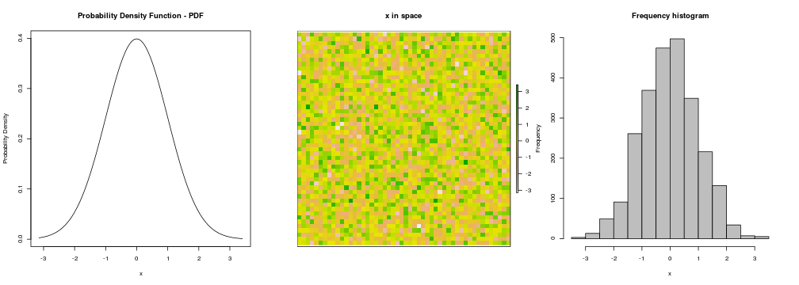
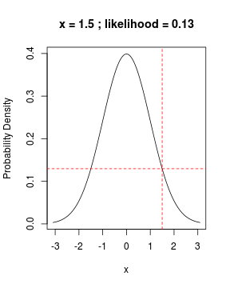
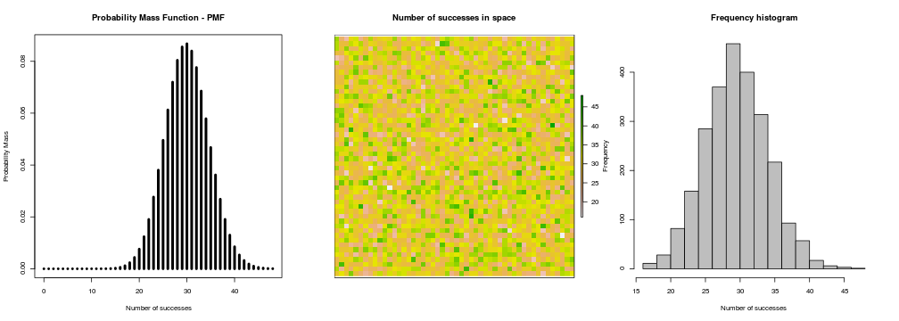
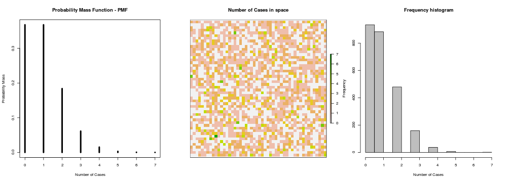
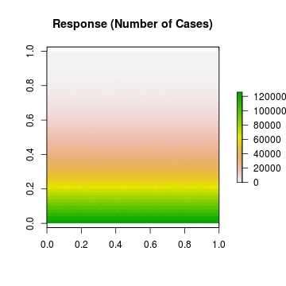
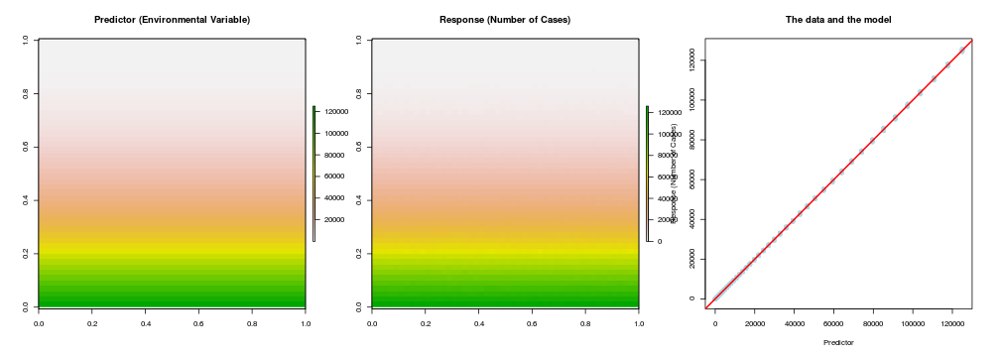
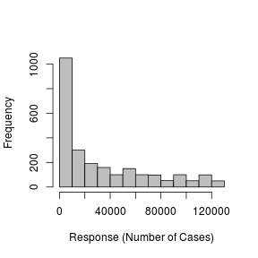

The data and the model
======================

We will only need one package for this exercise:

```r
library(raster)
```


Simple Normal world
-------------------

The world is a raster of 50 x 50 cells. Each cell contains value that is an independent outcome of a **Normally distributed random process with given mean and variance**:

```r
# the parameters of the Normal distribution
mean <- 0
sd <- 1

# random draws from the Normal distribution
normal.world <- raster(matrix(NA, nrow = 50, ncol = 50))
normal.world[] <- rnorm(2500, mean, sd)

par(mfrow = c(1, 3))
# plotting the probability density function
curve(dnorm(x, mean, sd), from = min(normal.world[]), to = max(normal.world[]), 
    main = "Probability Density Function - PDF", xlab = "x", ylab = "Probability Density")
# plotting the raster world
plot(normal.world, axes = FALSE, main = "x in space")
# plotting the empirical histogram
hist(normal.world, xlab = "x", ylab = "Frequency", main = "Frequency histogram", 
    col = "grey")
```

 


p(D|H): The Likelihood
----------------------
Calculation of likelihood in R is easy! The R functions ```dnorm()```, ```dpois()```, ```dunif()```, ```dbinom()```, ```dgamma()```, ```dbeta()``` etc. are exactly for that!

Example: What is the probability that x will have the observed values of 1.5, given the Normal(mean, sd) model?

```r
mean <- 0
sd <- 1
x <- 1.5

# this is how you calculate the likelihood:
likelihood <- dnorm(x, mean, sd)
likelihood
```

```
## [1] 0.1295
```


We can plot it:

```r
curve(dnorm(x, mean, sd), from = qnorm(0.001, mean, sd), to = qnorm(0.999, mean, 
    sd), main = paste("x =", x, "; likelihood =", round(likelihood, 3)), xlab = "x", 
    ylab = "Probability Density")
abline(v = x, col = "red", lty = 2)
abline(h = likelihood, col = "red", lty = 2)
```

 


Simple Binomial world
---------------------

The world is a raster of 50 x 50 cells. Each cell contains value that is an independent outcome of a **Binomially-distributed random process with given parameters $p$ and $n$** (number of "coin tosses"):


```r
# the parameters of the Binomial distribution Note: if n.tosses=1 then we do
# Bernoulli trial
p = 0.3
n.tosses = 1

# random draws from Binomial
binomial.world <- raster(matrix(NA, nrow = 50, ncol = 50))
binomial.world[] <- rbinom(2500, size = n.tosses, p = p)

par(mfrow = c(1, 3))
# plotting the probability mass function
plot(0:max(binomial.world[]), dbinom(0:max(binomial.world[]), size = n.tosses, 
    p = p), type = "h", lwd = 4, xlab = "Number of successes", ylab = "Probability Mass", 
    main = "Probability Mass Function - PMF")
# plotting the raster
plot(binomial.world, axes = FALSE, main = "Number of successes in space")
# plotting empirical histogram
hist(binomial.world, xlab = "Number of successes", ylab = "Frequency", main = "Frequency histogram", 
    col = "grey")
```

 


How would you calculate likelihood of observing a successful outcome of a trial, given p=0.1?

Simple Poisson world
--------------------

The world is a raster of 50 x 50 cells. Each cell contains value that is an independent outcome of a **Poisson-distributed random process with given parameter lambda ($\lambda$)**:


```r
# the parameter of the Poisson distribution
lambda = 1

# random draws from the Poisson
poisson.world <- raster(matrix(NA, nrow = 50, ncol = 50))
poisson.world[] <- rpois(2500, lambda = lambda)

par(mfrow = c(1, 3))
# plot of the probability mass function
plot(0:max(poisson.world[]), dpois(0:max(poisson.world[]), lambda), type = "h", 
    lwd = 4, xlab = "Number of Cases", ylab = "Probability Mass", main = "Probability Mass Function - PMF")
# plotting the raster
plot(poisson.world, axes = FALSE, main = "Number of Cases in space")
# plotting empirical histogram
hist(poisson.world, xlab = "Number of Cases", ylab = "Frequency", main = "Frequency histogram", 
    col = "grey")
```

 


How would you calculate likelihood of observing a 10 cases, given that $\lambda$=5?

Introducing spatial gradient
----------------------------

Let's assume that there is an evnironmental variable that has a form of a linear gradient in space:

```r
environment <- raster(matrix(NA, nrow = 50, ncol = 50))
environment[] <- rep(1:50, each = 50)
plot(environment, main = "Predictor (Environmental Variable)")
```

 


Now we can make the observed **Number of Cases** (the Response) to be Poisson-distributed and dependent on the environmental variable. The formal definition of this would be
$Response_i \sim  Poisson(Gradient_i)$
where $i$ is the cell-specific index.

```r
response <- raster(matrix(NA, nrow = 50, ncol = 50))
response[] <- rpois(2500, lambda = environment[])
plot(response, main = "Response (Number of Cases)")
```

 


Now we can plot it all together:

```r
par(mfrow = c(1, 3))
plot(environment, main = "Predictor (Environmental Variable)")
plot(response, main = "Response (Number of Cases)")
plot(environment[], response[], pch = 19, col = "lightblue", xlab = "Predictor", 
    ylab = "Response (Number of Cases)", main = "The data and the model")
abline(a = 0, b = 1, lwd = 2, col = "red")
# the 95% prediction intervals
lines(1:50, qpois(p = 0.975, lambda = 1:50), col = "red")
lines(1:50, qpois(p = 0.025, lambda = 1:50), col = "red")
```

 


And here is a proof of the fact that it is not the distribution of your data that matters for the choice of the proper statistical tool:

```r
hist(response, main = "", xlab = "Response (Number of Cases)", col = "grey")
```

 

The data are clearly non-poisson, yet each data point was generated by a poisson-distributed random process!

