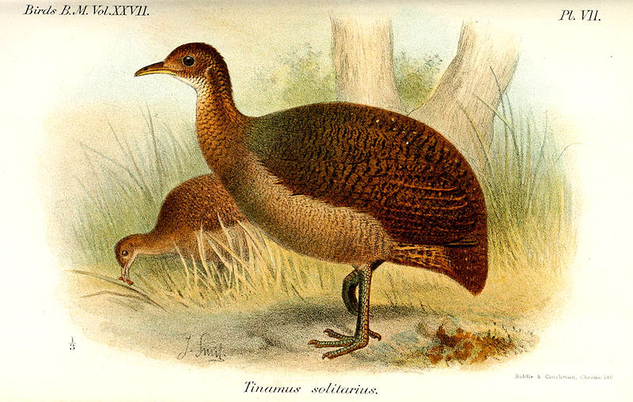
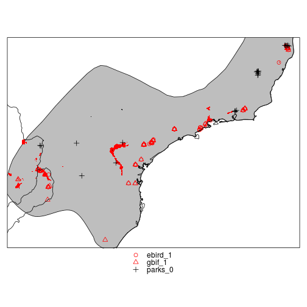
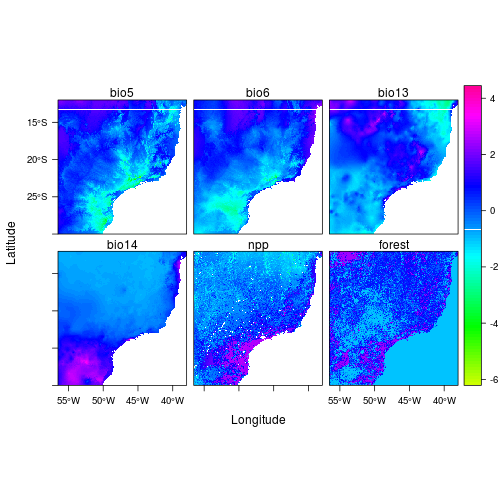
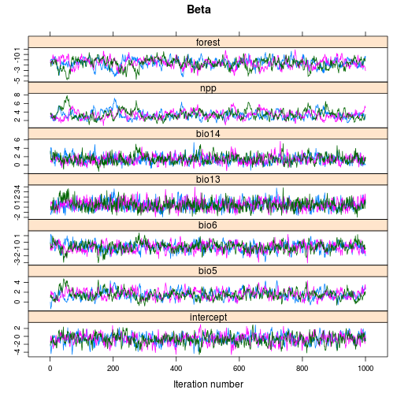
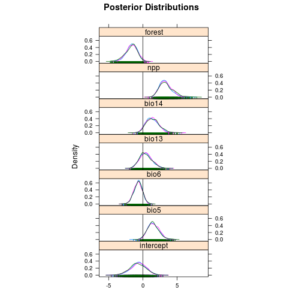
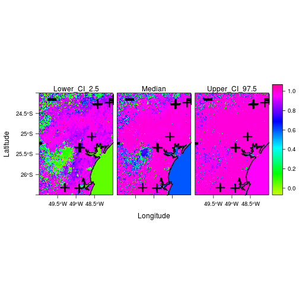

# Simple species distribution model workflow

In this session we will perform a simple species distribution model workflow for the Solitary Tinamou (Tinamus solitarius).  

Illustration by Joseph Smit, 1895


## Objectives

In this session we will:

 1. Download and process some raster environmental data
 2. Process occurrence data from various sources
 3. Fit a Bayesian species distribution model using the observations and environmental data
 4. Predict across the landscape and write the results to disk as a geotif (for use in GIS, etc.)
 
 


## Data processing

### Import Gridded Environmental Data
Import some evironmental data (Climate, NPP, & Forest) and align it to a common grid

```r
# system('bash DataPrep.sh')
```


Read them in as a raster stack

```r
env = stack(list.files(path = "data/", pattern = "*_clip.tif$", full.names = TRUE))
## do some renaming for convenience
names(env) = sub("_34", "", names(env))
names(env) = sub("_clip", "", names(env))
names(env)[names(env) == "MOD17A3_Science_NPP_mean_00_12"] = "npp"
## set missing value in npp
NAvalue(env[["npp"]]) = 65535
## get total % forest
forest = sum(env[[grep("consensus", names(env))]])
names(forest) = "forest"
## add forest into the env stack
env = stack(env, forest)
## List all available environmental data
names(env)
```

```
##  [1] "alt_clip_clip"                      
##  [2] "alt_clip"                           
##  [3] "alt"                                
##  [4] "bio13_clip_clip"                    
##  [5] "bio13_clip"                         
##  [6] "bio13"                              
##  [7] "bio14_clip_clip"                    
##  [8] "bio14_clip"                         
##  [9] "bio14"                              
## [10] "bio5_clip_clip"                     
## [11] "bio5_clip"                          
## [12] "bio5"                               
## [13] "bio6_clip"                          
## [14] "bio6"                               
## [15] "consensus_1km_class_1_clip"         
## [16] "consensus_1km_class_1"              
## [17] "consensus_1km_class_2_clip"         
## [18] "consensus_1km_class_2"              
## [19] "consensus_1km_class_3_clip"         
## [20] "consensus_1km_class_3"              
## [21] "consensus_1km_class_4_clip"         
## [22] "consensus_1km_class_4"              
## [23] "MOD17A3_Science_NPP_mean_00_12_clip"
## [24] "npp"                                
## [25] "forest"
```


### Import point observations
Download point data of occurrences from the Global Biodiversity Information Facility (GBIF) dataset 

```r
gbif_points = gbif("Tinamus", "solitarius", download = T, geo = T)
```

```
## Loading required package: XML
```

```
## Tinamus solitarius : 69 occurrences found
## 1-69
```

```r
gbif_points = gbif_points[!is.na(gbif_points$lat), ]
```

Import the ebird points

```r
ebird = read.table("data/lat_long_ebd.txt", header = TRUE)
```


Import a presence-absence shapefile from park checklists.

```r
parks = readOGR("data/", "protected_areas")
```

```
## OGR data source with driver: ESRI Shapefile 
## Source: "data/", layer: "protected_areas"
## with 46 features and 30 fields
## Feature type: wkbPolygon with 2 dimensions
```

```r
## Many of the parks with no observered presences were recorded as NA in the
## 'Presence' Column. Replace them with 0s.
parks$Presence[is.na(parks$Presence)] = 0
## generate an 'absence' dataset by sampling from the parks with no observed
## presences
nulls = coordinates(spsample(parks[parks$Presence == 0, ], 25, type = "stratified"))
```


Import IUCN expert range map

```r
tin_range = readOGR("data/", "iucn_birds_proj")
```

```
## OGR data source with driver: ESRI Shapefile 
## Source: "data/", layer: "iucn_birds_proj"
## with 1 features and 1 fields
## Feature type: wkbPolygon with 2 dimensions
```

```r
tin_range = spTransform(tin_range, CRS("+proj=longlat +ellps=WGS84 +datum=WGS84 +no_defs"))
```


Build a combined dataset (with source, presence/absence, and coordinates)

```r
points = rbind.data.frame(data.frame(src = "gbif", obs = 1, lat = gbif_points$lat, 
    lon = gbif_points$lon), data.frame(src = "ebird", obs = 1, lat = ebird$LATITUDE, 
    lon = ebird$LONGITUDE), data.frame(src = "parks", obs = 0, lat = nulls[, 
    "x2"], lon = nulls[, "x1"]))
## turn it into a spatial dataframe and define projection
coordinates(points) = c("lon", "lat")
projection(points) = "+proj=longlat +ellps=WGS84 +datum=WGS84 +no_defs"

## Create a combined src_presence field for easy plotting
points$type = paste(points$src, points$obs, sep = "_")
```


Import a world country boundary to ground the map

```r
World = readShapePoly("data/world_country_admin_boundary_shapefile_with_fips_codes.shp")
projection(World) = "+proj=longlat +ellps=WGS84 +datum=WGS84 +no_defs"
```


As we saw before, there are a few points just outside the range, but those in the ocean are most likely wrong.  Let's add the distance to the range polygon as a way to filter the observations.  First we need a equidistant projection to do the calculation

```r
dproj = CRS("+proj=eqc +lat_ts=0 +lat_0=0 +lon_0=0 +x_0=0 +y_0=0 +a=6371007 +b=6371007 +units=m +no_defs")
points$dist = gDistance(spTransform(points, dproj), spTransform(tin_range, dproj), 
    byid = T)[1, ]
## that adds 'distance' (in meters) from each point to the polygon so some
## points are > 2000km from the range, let's drop any more than 10km
points = points[points$dist < 10000, ]
```


Check out the data in a plot

```r
spplot(points, zcol = "type", pch = 1:3, col.regions = c("red", "red", "black")) + 
    layer(sp.polygons(parks, col = NA, fill = ifelse(parks$Presence == 0, "black", 
        "red")), under = T) + layer(sp.polygons(World)) + layer(sp.polygons(tin_range, 
    fill = "grey"), under = T)
```

 


Variable selection is tricky business and we're not going to dwell on it here... We'll use the following variables

```r
vars = c("bio5", "bio6", "bio13", "bio14", "npp", "forest")
```

[Worldclim "BIO" variables](http://www.worldclim.org/bioclim)

 * BIO5 = Max Temperature of Warmest Month
 * BIO6 = Min Temperature of Coldest Month
 * BIO13 = Precipitation of Wettest Month
 * BIO14 = Precipitation of Driest Month

To faciliate model fitting and interpretation, let's scale the environmental data

```r
senv = scale(env[[vars]])
## Make a plot to explore the data
levelplot(senv, col.regions = rainbow(100, start = 0.2, end = 0.9), cuts = 99)
```

 


Add the (scaled) environmental data to each point

```r
pointsd = extract(senv, points, sp = F)
## create single data.frame to hold all data for modelling
pointsd2 = data.frame(obs = points$obs, pointsd)
```


## Fit a simple GLM to the data

```r
m1 = glm(obs ~ bio5 + bio6 + bio13 + bio14 + npp + forest, data = pointsd2, 
    family = "binomial")
summary(m1)
```

```
## 
## Call:
## glm(formula = obs ~ bio5 + bio6 + bio13 + bio14 + npp + forest, 
##     family = "binomial", data = pointsd2)
## 
## Deviance Residuals: 
##    Min      1Q  Median      3Q     Max  
## -2.957   0.169   0.365   0.529   1.112  
## 
## Coefficients:
##             Estimate Std. Error z value Pr(>|z|)    
## (Intercept)    0.736      0.851    0.86  0.38730    
## bio5           1.977      0.679    2.91  0.00358 ** 
## bio6          -1.237      0.559   -2.21  0.02695 *  
## bio13          0.464      0.725    0.64  0.52224    
## bio14         -0.577      0.577   -1.00  0.31732    
## npp            2.168      0.611    3.55  0.00039 ***
## forest        -0.685      0.588   -1.16  0.24409    
## ---
## Signif. codes:  0 '***' 0.001 '**' 0.01 '*' 0.05 '.' 0.1 ' ' 1
## 
## (Dispersion parameter for binomial family taken to be 1)
## 
##     Null deviance: 143.85  on 175  degrees of freedom
## Residual deviance: 100.41  on 169  degrees of freedom
## AIC: 114.4
## 
## Number of Fisher Scoring iterations: 6
```


## Simple Bayesian Distribution Model

```r
## create the data object 
jags.data <- list(N.cells = nrow(pointsd2),
                  obs=points$obs,
                  X=data.frame(1,pointsd2[,vars]),
                  nBeta=length(vars)+1)
 
# define the model
cat("
    model
{
    # priors
    for (l in 1:nBeta) {
    beta[l] ~ dnorm(0,0.01)
    }
    
    # likelihood
    for(i in 1:N.cells)
{
    # The observation as the result of a bernoulli outcome
    obs[i] ~ dbern(p[i])
    # logit transformation
    p[i]<-1/(1+exp(-lp.lim[i]))
    # Alternatively, could use the built-in function
    # logit(p[i])<-lp.lim[i]
    # 'stabilize' the logit to prevent hitting size limits
    lp.lim[i]<-min(999,max(-999,lp[i])) 
    }
    # The regression 
    # (using matrix notation rather than lp<-beta1+beta2*X1, etc)
    lp <- X%*%beta
    }
    ", file="model.txt")

params <- c("beta","p")

jm <- jags.model("model.txt",
                 data = jags.data,
                 n.chains = 3,
                 n.adapt = 2000)
```

```
## Compiling model graph
##    Resolving undeclared variables
##    Allocating nodes
##    Graph Size: 2657
## 
## Initializing model
```


The model has been defined and an initial adaptive run of 2000 iterations complete.  Let's take some samples.

```r
jm.sample <- jags.samples(jm, variable.names = params, n.iter = 1000, thin = 1)
```


Extract the posterior samples and convert to `mcmc.list` objects for plotting/summaries

```r
ps.beta = as.mcmc.list(jm.sample$beta)
ps.p = as.mcmc.list(jm.sample$p)
```


### Check Convergence

```r
xyplot(ps.beta, main = "Beta", strip = strip.custom(factor.levels = c("intercept", 
    vars)))
```

 

```r
gelman.diag(ps.beta, confidence = 0.95, autoburnin = F, multivariate = T)
```

```
## Potential scale reduction factors:
## 
##      Point est. Upper C.I.
## [1,]       1.01       1.02
## [2,]       1.02       1.05
## [3,]       1.02       1.05
## [4,]       1.02       1.06
## [5,]       1.01       1.05
## [6,]       1.01       1.03
## [7,]       1.05       1.14
## 
## Multivariate psrf
## 
## 1.05
```


## Summarize the posterior betas

```r
densityplot(ps.beta, main = "Posterior Distributions", strip = strip.custom(factor.levels = c("intercept", 
    vars)), scales = list(relation = "same"), layout = c(1, 7)) + layer(panel.abline(v = 0))
```

 

```r
HPDinterval(ps.beta[[1]], prob = 0.95)
```

```
##        lower   upper
## var1 -0.6630  2.2311
## var2  0.7222  3.7751
## var3 -2.6879 -0.2669
## var4 -0.6475  2.4063
## var5 -1.7972  0.5651
## var6  1.2727  3.4034
## var7 -1.5844  0.3585
## attr(,"Probability")
## [1] 0.95
```


## Predict model to the grid


```r
## First subset area to speed up predictions
pext = extent(c(-50, -48, -26.5, -24))
penv = crop(senv, pext)

## if you want to make predictions for the full grid, run this line:
## penv=senv

## Calculate posterior estimates of p(occurrence) for each cell This extracts
## the posterior coefficients, performs the regression, calculates the
## quantiles, and takes the inverse logit to get p(occurrence)

## niter will use a reduced number of posterior samples to generate the
## summaries
pred = calc(penv, function(x, niter = 30) {
    mu1 = apply(apply(ps.beta[[1]][1:niter, ], 1, function(y) y * c(1, x)), 
        2, sum, na.rm = T)
    mu2 = quantile(mu1, c(0.025, 0.5, 0.975), na.rm = T)
    p = 1/(1 + exp(-mu2))
    return(p)
})
names(pred) = c("Lower_CI_2.5", "Median", "Upper_CI_97.5")
## Write out the predictions
writeRaster(pred, file = "output/Prediction.tif", overwrite = T)
```

```
## class       : RasterBrick 
## dimensions  : 300, 240, 72000, 3  (nrow, ncol, ncell, nlayers)
## resolution  : 0.008333, 0.008333  (x, y)
## extent      : -50, -48, -26.5, -24  (xmin, xmax, ymin, ymax)
## coord. ref. : +proj=longlat +datum=WGS84 +no_defs +ellps=WGS84 +towgs84=0,0,0 
## data source : /home/user/ost4sem/exercise/SpatialAnalysisTutorials/workflow/Solitary_Tinamou/output/Prediction.tif 
## names       : Prediction.1, Prediction.2, Prediction.3 
## min values  :    7.843e-06,    7.244e-05,    4.507e-04 
## max values  :       0.9999,       1.0000,       1.0000
```


Plot the predictions

```r
levelplot(pred,col.regions=rainbow(100,start=.2,end=.9),cuts=99,margin=F)+
  layer(sp.polygons(tin_range,lwd=2))+
  layer(sp.points(points[points$obs==0,],pch="-",col="black",cex=8,lwd=4))+ #add absences
  layer(sp.points(points[points$obs==1,],pch="+",col="black",cex=4,lwd=4))    #add presences
```

 


# Summary

In this script we have illustrated a complete workflow, including:

 1. Calling a BASH script (including GDAL Functions) from R to perform data pre-processing
 2. Running a (simple) Bayesian Species Distribution Model using rjags
 3. Making spatial predictions from model posteriors
 4. Writing results to disk as a geotif (for use in GIS, etc.)
 
